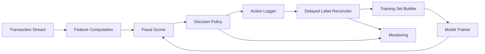

# Delayed-Label Fraud Decisioning

A first-principles machine learning system for **real-time fraud decisioning under delayed labels, asymmetric costs, and temporal drift**.

> Most fraud detection projects optimize offline classification metrics on data where the label is already known.  
> This project addresses the actual production problem: **decide now, when the truth arrives 30–120 days later.**

---

## Problem

In modern payment systems, a transaction must be approved, reviewed, or blocked in **milliseconds to seconds**, but the fraud label (chargeback, dispute, investigation outcome) may not arrive for **weeks or months**.

This creates a structural mismatch:

- The model must act **before** it can know whether it was correct.
- Observed labels are **delayed, partial, and biased** by prior decisions.
- Errors are **asymmetric**: a missed fraud and a false positive do not cost the same.
- Fraudsters **adapt**, so the data distribution drifts.

Standard tutorials frame this as binary classification:  
`dataset → model → AUC`.

This project frames it as a **sequential decision problem under delayed feedback**:

```text
observe → decide → act → observe delayed/biased outcome → update → monitor → adapt
```

---

## Core Question

> How can a fraud detection system decide **now** when the truth about whether that decision was correct may not arrive for weeks or months?

---

## Approach

The system optimizes **operational utility**, not classification accuracy:

```text
utility = fraud loss avoided
        − false-positive cost
        − review cost
```

### Decision Policy

For each transaction, given predicted fraud probability `p`:

```text
E[cost(approve)] = p * fraud_loss
E[cost(review)]  = review_cost + p * residual_fraud_loss
E[cost(block)]   = (1 - p) * false_positive_cost

action = argmin over {approve, review, block}
```

The policy is evaluated by **realized cost under temporal backtest**, not by AUC.

---

## System Architecture



See [docs/architecture.md](docs/architecture.md) for the full Week 1 MVP architecture.

---

## Status

**Week 1 — baseline end-to-end pipeline in progress.**

Current state:

- [x] Problem framing
- [x] Architecture
- [x] Evaluation protocol
- [ ] Data card
- [ ] Decision policy doc
- [ ] Roadmap
- [ ] Data loader
- [ ] Delay simulator
- [ ] Temporal splitter
- [ ] Baseline model
- [ ] Decision policy
- [ ] Cost-based backtest
- [ ] Week 1 report

---

## Documentation

| Document | Purpose |
|---|---|
| [Problem Framing](docs/problem_framing.md) | First-principles problem decomposition |
| [Architecture](docs/architecture.md) | Week 1 MVP pipeline and contracts |
| [Evaluation Protocol](docs/evaluation_protocol.md) | Cost matrix, temporal backtest, baselines |
| [Data Card](docs/data_card.md) | Dataset, schema, label-delay simulation |
| [Decision Policy](docs/decision_policy.md) | Actions, expected cost, thresholds |
| [Roadmap](docs/roadmap.md) | MVP, weekly milestones, non-goals |

---

## Setup

### Requirements

- Python 3.11 (3.10 also supported)
- PowerShell, Bash, or any shell

### Install

```bash
python -m venv .venv
# Windows
.\.venv\Scripts\Activate.ps1
# macOS / Linux
source .venv/bin/activate

python -m pip install --upgrade pip
pip install -r requirements.txt
```

Locked versions are in `requirements.lock.txt` for reproducibility.

---

## Run (Week 1)

```bash
python -m src.pipeline --config configs/week1.yaml
```

Or, if using `make`:

```bash
make week1
```

Outputs:

- `data/processed/decisions.parquet`
- `data/processed/action_log.parquet`
- `reports/week1_backtest.md`

---

## Data

Primary dataset: **Bank Account Fraud (BAF) Suite**  
Secondary: **IEEE-CIS Fraud Detection**

Raw and processed data are **not committed** to this repository.  
See [docs/data_card.md](docs/data_card.md) for schema, splits, and label-delay simulation assumptions.

---

## Evaluation

All results are reported under:

- **Chronological splits only** — no random splits, ever
- **Three label-delay regimes** — 7 / 30 / 90 days
- **Fixed cost matrix** — documented in `configs/costs.yaml`
- **Fixed review budget** — top 1% / 5% / 10%

Primary metrics:

- Cost per transaction
- Fraud dollars saved at fixed FPR
- Fraud dollars saved at fixed review budget
- Precision@N, Recall@N
- Calibration error (Brier, ECE)

AUC is reported but never used as the sole success criterion.

See [docs/evaluation_protocol.md](docs/evaluation_protocol.md) for the full protocol.

---

## Repository Layout

```text
delayed-label-fraud-decisioning/
├── README.md
├── requirements.txt
├── requirements.lock.txt
├── .gitignore
├── configs/
│   ├── costs.yaml
│   └── splits.yaml
├── data/
│   ├── raw/                 # gitignored
│   ├── interim/             # gitignored
│   └── processed/           # gitignored
├── docs/
│   ├── problem_framing.md
│   ├── architecture.md
│   ├── evaluation_protocol.md
│   ├── data_card.md
│   ├── decision_policy.md
│   └── roadmap.md
├── notebooks/
├── reports/
│   └── week1_backtest.md
├── src/
│   ├── data/
│   ├── models/
│   ├── policy/
│   └── evaluation/
└── tests/
```

---

## Non-Goals (Week 1)

Explicitly out of scope to prevent over-engineering:

- Streaming infrastructure (Kafka, Faust)
- Service layer (FastAPI, Uvicorn)
- Dashboards (Streamlit, Dash, Grafana)
- Online learning (SGD, Passive-Aggressive)
- PU learning
- Delayed-label correction models
- Drift detectors
- Graph neural networks
- Federated learning
- Deep learning
- Docker / Kubernetes
- MLflow / W&B / DVC

These are only added after the Week 1 baseline is measured and a specific failure justifies them.

---

## Roadmap

- **Week 1:** baseline end-to-end pipeline + cost-based backtest
- **Week 2:** calibration + cost-sensitive LightGBM
- **Week 3:** policy tuning + capacity simulation + rolling backtest
- **Week 4:** one improvement (online learning / PU learning / delayed-label correction), final report, demo

See [docs/roadmap.md](docs/roadmap.md) for details.

---

## Why This Project

Most fraud detection projects stop at “train XGBoost, report AUC.”  
This project treats fraud detection as what it actually is: a **decision system under delayed, biased, adversarial feedback**.

The goal is not a novel algorithm.  
The goal is a **correct, honest, reproducible loop** that later improvements can build on.

---

## License

TBD — will be added before public release.

## Author

Kira — Introduction to Machine Learning final project
