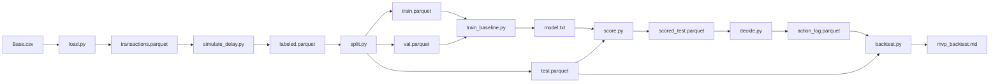

# Delayed-Label Fraud Decisioning

A cost-sensitive fraud decision policy evaluated under delayed, censored, and
biased labels. Built as a one-step decision problem — not a classification
problem — with a pre-registered evaluation protocol and a temporal backtest.

> Most fraud detection projects optimize offline classification metrics on
> data where the label is already known. This project addresses the
> operational problem: **decide now, when the truth may not arrive for weeks
> or months.**

---

## Headline Result

Under a 1-month delayed-label regime with a chronological train / validation
/ test split, the cost-sensitive policy reduces realized cost per transaction
by **56.87%** relative to the strongest baseline, with a 95% bootstrap
confidence interval of **[52.77%, 60.91%]**.

| Baseline | Cost per transaction |
|---|---:|
| Random | 0.046931 |
| Approve-all | 0.018928 |
| Block-all | 0.098742 |
| LightGBM + static 0.5 | 0.017543 |
| **Cost-sensitive policy (ours)** | **0.007566** |

The result is robust to a 2× variation in each cost parameter
(`false_positive_cost`, `review_cost`, `residual_fraud_loss`); the minimum
advantage across all variations is **46.46%**.

See [`reports/mvp_backtest.md`](reports/mvp_backtest.md) for the full report,
[`reports/sensitivity.md`](reports/sensitivity.md) for cost sensitivity, and
[`reports/bootstrap.md`](reports/bootstrap.md) for confidence intervals.

---

## Problem

A transaction must be approved, reviewed, or blocked in **milliseconds**, but
the fraud label (chargeback, dispute, investigation outcome) may not arrive
for **weeks or months**. This creates a structural mismatch:

- The model must act **before** it can know whether it was correct.
- Observed labels are **delayed, censored, and biased** by prior decisions.
- Errors are **asymmetric**: a missed fraud and a false positive do not cost
  the same.
- Fraudsters **adapt**, so the data distribution drifts.

Standard tutorials frame this as binary classification:
`dataset → model → AUC`.

This project frames it as a **one-step decision problem under delayed
feedback**:

```text
observe → decide → act → observe delayed/partial outcome → evaluate
```

Full online adaptation and delayed-label correction are future work.

---

## Approach

The system optimizes **operational utility**, not classification accuracy:

```text
utility = fraud loss avoided
        − false-positive cost
        − review cost
```

### Decision Policy

For each transaction, given predicted fraud probability `p`:

```text
E[cost(approve)] = p * fraud_loss(amount)
E[cost(review)]  = review_cost + p * residual_fraud_loss
E[cost(block)]   = (1 - p) * false_positive_cost

action = argmin over {approve, review, block}
```

The argmin rule is the source of truth. Derived thresholds are a diagnostic
view only. `fraud_loss` scales with transaction amount under the adopted
amount-scaled cost model.

The model is evaluated by **realized cost under a chronological backtest**,
not by AUC.

---

## Reproduce in Three Commands

```bash
# Full pipeline: load → simulate delay → split → train → score → decide → backtest
python -m src.pipeline

# Cost sensitivity analysis (writes reports/sensitivity.md)
python -m src.evaluation.sensitivity

# Bootstrap confidence intervals (writes reports/bootstrap.md)
python -m src.evaluation.bootstrap
```

Tests:

```bash
pytest
# 13 passed in ~1.4s
```

The pipeline reproduces byte-for-byte. Given `data/raw/baf/Base.csv` plus
`configs/costs.yaml` and the fixed seeds, every number in the report
regenerates.

### Environment

```bash
python -m venv .venv
.\.venv\Scripts\Activate.ps1      # Windows
# source .venv/bin/activate       # macOS / Linux

python -m pip install --upgrade pip
pip install -r requirements.txt
```

Pinned library versions: Python 3.10, LightGBM 4.7.0, pandas 2.3.3,
numpy 2.2.6, pyarrow 19.0.1, scikit-learn 1.7.2, PyYAML 6.0.3.

---

## Documentation

Start with these four. Everything else is depth.

| Document | Purpose |
|---|---|
| [Problem Framing](docs/problem_framing.md) | First-principles problem decomposition, scope, success criteria |
| [Evaluation Protocol](docs/evaluation_protocol.md) | Cost matrix, temporal backtest, canonical baselines, forbidden metrics |
| [Decision Policy](docs/decision_policy.md) | Actions, expected cost, threshold derivation, action log schema |
| [Data Card](docs/data_card.md) | Dataset, schema, label-delay simulation, leakage and bias registers |

Depth and process:

| Document | Purpose |
|---|---|
| [MVP Architecture](docs/mvp_architecture.md) | The as-built pipeline (source of truth for what exists) |
| [Full Architecture](docs/architecture.md) | Post-MVP architecture spec with data-driven stop criteria |
| [MVP Plan](docs/mvp_2_weeks.md) | Original 2-week plan (superseded; kept for context) |
| [Roadmap](docs/roadmap.md) | Weekly plan, gated on measured failure |

Paper materials for the course submission:

| Document | Purpose |
|---|---|
| [Paper Blueprint](docs/paper/paper_blueprint.md) | IEEE section map |
| [Abstract & Index Terms](docs/paper/abstract_and_index_terms.md) | Copy-paste ready |
| [Introduction Draft](docs/paper/introduction_draft.md) | Section 1 skeleton with placeholders |
| [Reference Sheet](docs/paper/reference_sheet.md) | Every number and claim, one page |

Session-by-session build record: [`docs/daily_log/`](docs/daily_log/).

---

## What Was Built

A 7-step batch pipeline. Each step is a single script with one job.



**Scope of the current build:**

- Dataset: Bank Account Fraud (BAF) `Base.csv` — 1,000,000 rows, 32 features, ~1.1% fraud
- Delay regime: **1 month** (BAF exposes month-level granularity only)
- Splits: train months {0,1,2} · val {3,4} · test {5,6} · censored month 7
- Model: LightGBM binary classifier, library defaults, early stopping
- Policy: `argmin` of expected cost over `{approve, review, block}`
- Cost matrix: fixed in `configs/costs.yaml`, amount-scaled, rate
  calibrated on the **training window only**
- Baselines: random, approve-all, block-all, LightGBM + static 0.5 (5 total,
  including the policy)

**Key data integrity facts:**

| Fact | Value |
|---|---:|
| Total transactions | 1,000,000 |
| Censored (month 7, never observed) | 96,843 (9.68%) |
| Evaluated test rows | 227,491 |
| Test fraud rate | 1.2576% |

Censored labels are **excluded** from training and evaluation, never treated
as negative.

---

## Evaluation Discipline

This project has an unusual property for a student submission: it
**pre-registers** its evaluation and forbids practices that inflate results.

- **Temporal splits only.** No random splits, no shuffling, ever.
- **Delay-aware.** A label may only be used after `label_time`.
- **Cost-based.** Every decision is scored by realized cost.
- **Baseline-anchored.** Every improvement must beat a named baseline.
- **Pre-registered.** Metrics and thresholds fixed before modeling.
- **Honest.** Failures and non-findings are reported, not hidden.
- **Stopping rules.** Each phase has a data-driven stop criterion; the
  project stops when the data says to stop, not when ambition says to
  continue.

Forbidden metrics: raw accuracy, AUC-only claims, F1 without cost context.
AUC is reported informationally but never used as the sole success criterion.

See [`docs/evaluation_protocol.md`](docs/evaluation_protocol.md) for the full
protocol and [`docs/architecture.md`](docs/architecture.md) §9 for the stop
criteria.

---

## Repository Layout

```text
delayed-label-fraud-decisioning/
├── README.md
├── conftest.py                     # ensures pytest resolves src package
├── configs/
│   └── costs.yaml                  # only config file; frozen cost matrix
├── data/                           # gitignored
│   ├── raw/baf/Base.csv
│   ├── interim/
│   └── processed/
├── artifacts/model.txt             # gitignored
├── docs/
│   ├── problem_framing.md
│   ├── data_card.md
│   ├── decision_policy.md
│   ├── evaluation_protocol.md
│   ├── architecture.md
│   ├── mvp_architecture.md
│   ├── mvp_2_weeks.md
│   ├── roadmap.md
│   ├── daily_log/
│   └── paper/
├── reports/
│   ├── mvp_backtest.md             # primary deliverable
│   ├── sensitivity.md
│   └── bootstrap.md
├── scripts/
│   └── reconcile_docs.py
├── src/
│   ├── common.py
│   ├── pipeline.py
│   ├── data/{load,simulate_delay,split}.py
│   ├── models/{train_baseline,score}.py
│   ├── policy/decide.py
│   └── evaluation/{backtest,calibration,sensitivity,bootstrap}.py
└── tests/
    ├── test_policy.py
    └── test_backtest.py
```

---

## Non-Goals

Deliberately excluded to prevent over-engineering. Each is only added if a
measured failure justifies it and the addition has its own stop criterion.

- Streaming infrastructure (Kafka, RabbitMQ, Faust)
- Service layer (FastAPI, Uvicorn)
- Dashboards (Streamlit, Dash, Grafana)
- Online learning (SGD, Passive-Aggressive)
- PU learning
- Delayed-label correction models
- Drift detectors
- Graph neural networks or graph features
- Federated learning
- Deep learning
- Docker / Kubernetes
- MLflow / W&B / DVC
- Model registry, feature store, hyperparameter search frameworks
- Multi-regime delay (deferred; single 1-month regime in current build)
- Capacity simulation (deferred)
- Rule-based threshold baseline (deferred)

---

## Why This Project

Most fraud detection projects stop at "train XGBoost, report AUC."
This project treats fraud detection as what it actually is: a **decision
system under delayed, censored, and biased feedback**.

The goal is not a novel algorithm. The goal is a **correct, honest,
reproducible loop** with **explicit stopping rules**, so later improvements
rest on measured results rather than ambition.

---

## Citation

If you reference this work:

```bibtex
@misc{delayed_label_fraud_2026,
  title  = {Delayed-Label Fraud Decisioning: Cost-Sensitive Policy under
            Delayed and Censored Labels},
  author = {[Author names]},
  year   = {2026},
  note   = {Introduction to Machine Learning final project,
            National University Philippines}
}
```

---

## Author

Kira — Introduction to Machine Learning final project,
National University Philippines.

## License

TBD — will be added before public release.
