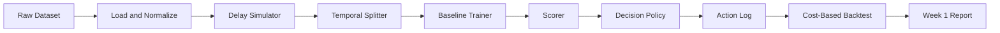

# Architecture

> **Repository:** `delayed-label-fraud-decisioning`  
> **Document:** Architecture (Week 1 MVP)  
> **Status:** v0.1  
> **Last updated:** YYYY-MM-DD

---

## 1. Purpose of This Document

Define the **minimum viable end-to-end pipeline** for Week 1.

The goal of Week 1 is **not** to build a production system. It is to prove the whole loop works end-to-end with the simplest possible components:

```text
data → delay simulation → temporal split → baseline model → decision policy → backtest → report
```

Everything else (streaming, online learning, dashboards, PU learning, drift detectors) is **explicitly deferred** until the baseline loop is working and measured.

This document exists to **prevent over-engineering in Week 1**.

---

## 2. Week 1 Design Principles

1. **Batch over streaming.** Simulate the stream as an ordered table, not a message queue.
2. **Scripts over services.** No APIs, no servers, no Docker orchestration.
3. **One model.** LightGBM. No ensembles, no deep learning, no online learning yet.
4. **One policy.** Expected-cost argmin with a fixed cost matrix.
5. **One backtest.** Chronological, delay-aware, cost-based.
6. **One report.** A markdown/notebook result, not a dashboard.
7. **No premature abstractions.** No plugin systems, no config frameworks beyond a YAML file.
8. **Everything reproducible.** Fixed seeds, fixed splits, fixed cost matrix, fixed delay regimes.

If a component is not required to produce the Week 1 report, it does not belong in Week 1.

---

## 3. Week 1 End-to-End Pipeline



That is the entire Week 1 system.

---

## 4. Component Specifications

### 4.1 Raw Dataset

- **Input:** Bank Account Fraud (BAF) suite (primary). IEEE-CIS only if needed later.
- **Storage:** `data/raw/`
- **Format:** CSV or Parquet
- **Week 1 rule:** Do not modify raw data. Treat it as immutable.

### 4.2 Load and Normalize

- **Script:** `src/data/load.py`
- **Output:** `data/interim/transactions.parquet`
- **Responsibilities:**
  - Load raw dataset
  - Standardize column names
  - Parse timestamps
  - Drop or flag unusable columns
  - Sort by timestamp
- **Not responsible for:** feature engineering, model input, graph construction.

### 4.3 Delay Simulator

- **Script:** `src/data/simulate_delay.py`
- **Output:** `data/interim/labeled_with_delay.parquet`
- **Responsibilities:**
  - Assign `decision_time = t`
  - Assign `label_time = t + Δ`
  - Sample `Δ` per delay regime: 7 / 30 / 90 days
  - Mark each label as `observed` or `unobserved` at any cutoff
- **Week 1 rule:** Delay is simulated, not real. Document assumptions in `data_card.md`.
- **Not responsible for:** modeling delay, correcting delay, causal inference.

### 4.4 Temporal Splitter

- **Script:** `src/data/split.py`
- **Output:** `data/processed/{train,val,test}.parquet`
- **Responsibilities:**
  - Chronological split only
  - Train cutoff `< T_train`
  - Validation cutoff `< T_val`
  - Test period `>= T_val`
  - Only use labels where `label_time <= split_time`
- **Week 1 rule:** No random splits. No shuffle. Ever.
- **Not responsible for:** rolling windows, walk-forward, drift detection.

### 4.5 Baseline Trainer

- **Script:** `src/models/train_baseline.py`
- **Model:** LightGBM binary classifier
- **Output:** `artifacts/model_baseline.txt`
- **Responsibilities:**
  - Train on `train.parquet`
  - Early stopping on `val.parquet`
  - Save model, feature list, training config
- **Week 1 rule:** One model. One config. No tuning beyond a small manual grid.
- **Not responsible for:** online learning, PU learning, ensembles, neural nets.

### 4.6 Scorer

- **Script:** `src/models/score.py`
- **Input:** `test.parquet`
- **Output:** `data/processed/scored_test.parquet` with `p_fraud`
- **Responsibilities:**
  - Load model
  - Produce calibrated-enough probabilities (raw LightGBM output is acceptable in Week 1)
  - Attach `p_fraud` to each transaction
- **Not responsible for:** thresholding, policy, alerting.

### 4.7 Decision Policy

- **Script:** `src/policy/decide.py`
- **Input:** scored transactions + fixed cost matrix
- **Output:** `data/processed/decisions.parquet`
- **Actions:** `approve`, `review`, `block`
- **Decision rule:** minimum expected cost

```text
E[cost(approve)] = p * fraud_loss
E[cost(review)]  = review_cost + p * residual_fraud_loss
E[cost(block)]   = (1 - p) * false_positive_cost
```

- **Week 1 rule:** Fixed cost matrix in `configs/costs.yaml`. No learned policy. No bandits.
- **Not responsible for:** capacity simulation, ranking, alert clustering.

### 4.8 Action Log

- **Script:** `src/policy/log_actions.py`
- **Output:** `data/processed/action_log.parquet`
- **Responsibilities:**
  - Record `transaction_id`, `decision_time`, `p_fraud`, `action`, `expected_cost`, `reason`
  - Serve as the audit trail for the backtest
- **Week 1 rule:** Plain Parquet file. No database, no queue, no server.

### 4.9 Cost-Based Backtest

- **Script:** `src/evaluation/backtest.py`
- **Input:** `decisions.parquet` + delayed labels
- **Output:** `reports/week1_backtest.md`
- **Responsibilities:**
  - Join decisions with labels **only when `label_time <= test_end`**
  - Compute realized cost
  - Compute fraud dollars saved
  - Compute precision@N, recall@N
  - Compute calibration error
  - Compare against:
    - random
    - rule-based threshold
    - LightGBM + static threshold
- **Week 1 rule:** Backtest is the final Week 1 deliverable. Not the model.

### 4.10 Week 1 Report

- **File:** `reports/week1_backtest.md`
- **Contents:**
  - Dataset and delay regime
  - Cost matrix
  - Baseline comparison table
  - Key metrics
  - Failure cases
  - Next-week plan

---

## 5. Repository Layout (Week 1)

```text
delayed-label-fraud-decisioning/
├── README.md
├── requirements.txt
├── .gitignore
├── configs/
│   ├── costs.yaml
│   └── splits.yaml
├── data/
│   ├── raw/                 # gitignored
│   ├── interim/             # gitignored
│   └── processed/           # gitignored
├── docs/
│   ├── problem_framing.md
│   ├── architecture.md
│   ├── data_card.md
│   ├── evaluation_protocol.md
│   ├── decision_policy.md
│   └── roadmap.md
├── notebooks/
│   └── week1_exploration.ipynb
├── reports/
│   └── week1_backtest.md
├── src/
│   ├── data/
│   │   ├── load.py
│   │   ├── simulate_delay.py
│   │   └── split.py
│   ├── models/
│   │   ├── train_baseline.py
│   │   └── score.py
│   ├── policy/
│   │   ├── decide.py
│   │   └── log_actions.py
│   └── evaluation/
│       └── backtest.py
└── tests/
    ├── test_delay.py
    ├── test_split.py
    └── test_policy.py
```

---

## 6. Interfaces and Contracts

Keep these stable. Everything else can change.

### 6.1 Transaction Schema (post-load)

| Column | Type | Notes |
|---|---|---|
| transaction_id | string | unique |
| decision_time | timestamp | when decision must be made |
| amount | float | transaction value |
| features... | mixed | model inputs |
| y_true | int | ground truth fraud label |
| label_time | timestamp | when label becomes observable |

### 6.2 Scored Schema

| Column | Type |
|---|---|
| transaction_id | string |
| decision_time | timestamp |
| p_fraud | float |
| amount | float |

### 6.3 Decision Schema

| Column | Type |
|---|---|
| transaction_id | string |
| action | enum {approve, review, block} |
| p_fraud | float |
| expected_cost | float |
| reason | string |

### 6.4 Cost Config

`configs/costs.yaml`:

```yaml
fraud_loss: 1.0
false_positive_cost: 0.1
review_cost: 0.02
residual_fraud_loss_after_review: 0.3
```

All costs are relative units in Week 1. Absolute calibration is out of scope.

---

## 7. What Is Explicitly Out of Scope for Week 1

Do not build any of the following in Week 1:

- Kafka, RabbitMQ, or any streaming infra
- FastAPI or any service
- Docker Compose orchestration
- Online learning (SGD, PA)
- PU learning
- Delayed-label correction models
- Drift detectors
- GNNs or graph features
- Federated learning
- Dashboards (Streamlit, Grafana, etc.)
- Model registry
- Feature store
- Hyperparameter search frameworks
- CI/CD
- Kubernetes
- Microservices

If any of these appear in Week 1, the project has drifted.

---

## 8. Week 1 Definition of Done

- [ ] Raw dataset loaded and normalized
- [ ] Delay simulator produces 7/30/90-day labels
- [ ] Temporal split produces train/val/test
- [ ] Baseline LightGBM trained
- [ ] Test set scored
- [ ] Decision policy applied with fixed cost matrix
- [ ] Action log written
- [ ] Cost-based backtest runs
- [ ] `reports/week1_backtest.md` written
- [ ] Baseline vs random vs static-threshold compared
- [ ] Reproducible with one command

One command to run the whole pipeline:

```bash
make week1
```

or

```bash
python -m src.pipeline --config configs/week1.yaml
```

Pick one. Keep it.

---

## 9. Evolution Path (After Week 1)

Only after Week 1 is done and measured:

- **Week 2:** Improve model (cost-sensitive LightGBM, calibration).
- **Week 3:** Improve policy (threshold optimization, capacity constraints).
- **Week 4:** Add online learning / PU learning / delayed-label correction as an experiment, not a rewrite.

Each addition must be justified by a **measured failure** of the Week 1 baseline. No exceptions.

---

## 10. Guiding Rule

> If a component does not change the Week 1 report, it does not belong in Week 1.

The Week 1 goal is not sophistication.  
The Week 1 goal is a **correct, honest, end-to-end loop** that later weeks can improve.
