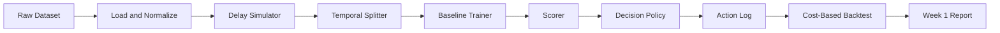

# Architecture

> **Repository:** `delayed-label-fraud-decisioning`  
> **Document:** Architecture (Week 1 MVP)  
> **Status:** v0.3 — Week 1 MVP with data-driven stop criteria  
> **Last updated:** 2026-09-22

---

## 1. Purpose of This Document

Define the **minimum viable end-to-end pipeline** for Week 1.

The goal of Week 1 is **not** to build a production system. It is to prove the whole loop works end-to-end with the simplest possible components:

```text
data → delay simulation → temporal split → baseline model → decision policy → backtest → report
```

Everything else (streaming, online learning, dashboards, PU learning, drift detectors) is **explicitly deferred** until the baseline loop is working and measured.

This document exists to **prevent over-engineering in Week 1** and to define **when to stop iterating** based on measured results.

---

## 2. Week 1 Design Principles

1. **Batch over streaming.** Replay the dataset as an ordered table, not a message queue.
2. **Scripts over services.** No APIs, no servers, no Docker orchestration.
3. **One model.** LightGBM. No ensembles, no deep learning, no online learning yet.
4. **One policy.** Expected-cost argmin with a fixed cost matrix.
5. **One backtest.** Chronological, delay-aware, cost-based.
6. **One report.** A markdown/notebook result, not a dashboard.
7. **No premature abstractions.** No plugin systems, no config frameworks beyond a YAML file.
8. **Everything reproducible.** Fixed seeds, fixed splits, fixed cost matrix, fixed delay regimes.
9. **Stop on measured results, not on feelings.** An iteration ends when its stop criterion is met (Section 9).

If a component is not required to produce the Week 1 report, it does not belong in Week 1.

---

## 3. Week 1 End-to-End Pipeline



That is the entire Week 1 system.

---

## 4. Component Specifications

### 4.1 Raw Dataset

- **Input:** Bank Account Fraud (BAF) suite (primary). IEEE-CIS only if needed later.
- **Storage:** `data/raw/`
- **Format:** CSV or Parquet
- **Week 1 rule:** Do not modify raw data. Treat it as immutable.

### 4.2 Load and Normalize

- **Script:** `src/data/load.py`
- **Output:** `data/interim/transactions.parquet`
- **Responsibilities:**
  - Load raw dataset
  - Standardize column names
  - Parse timestamps
  - Drop or flag unusable columns
  - Sort by timestamp
- **Not responsible for:** feature engineering, model input, graph construction.

### 4.3 Delay Simulator

- **Script:** `src/data/simulate_delay.py`
- **Output:** `data/interim/labeled_with_delay.parquet`
- **Responsibilities:**
  - Assign `decision_time = t`
  - Assign `label_time = t + Δ` using a **fixed** Δ per regime
  - Produce three regimes: 7 / 30 / 90 days
  - Mark each label as `observed` or `censored` at any cutoff
- **Week 1 rule:** Δ is fixed per regime, not sampled per transaction. Delay is simulated, not real. All assumptions live in `data_card.md`.
- **Blocking pre-step:** BAF timestamp granularity must be verified (see `data_card.md` Section 4.6). If day-level timestamps are not available, regimes become 1 / 2 / 3 months and this document is updated.
- **Not responsible for:** modeling delay, correcting delay, causal inference.

### 4.4 Temporal Splitter

- **Script:** `src/data/split.py`
- **Output:** `data/processed/{train,val,test}.parquet`
- **Responsibilities:**
  - Chronological split only
  - Train: `decision_time < T_train` **and** `label_time <= T_train`
  - Validation: `T_train <= decision_time < T_val` **and** `label_time <= T_val`
  - Test: `decision_time >= T_val` **and** `label_time <= test_end`
  - Censored rows excluded from each split and counted
- **Week 1 rule:** No random splits. No shuffle. Ever.
- **Not responsible for:** rolling windows, walk-forward, drift detection.

### 4.5 Baseline Trainer

- **Script:** `src/models/train_baseline.py`
- **Model:** LightGBM binary classifier
- **Output:** `artifacts/model_baseline.txt`
- **Responsibilities:**
  - Train on `train.parquet`
  - Early stopping on `val.parquet`
  - Save model, feature list, training config
- **Week 1 rule:** One model. One config. No tuning beyond a small manual grid.
- **Not responsible for:** online learning, PU learning, ensembles, neural nets.

### 4.6 Scorer

- **Script:** `src/models/score.py`
- **Input:** `test.parquet`
- **Output:** `data/processed/scored_test.parquet` with `p_fraud`
- **Responsibilities:**
  - Load model
  - Produce probabilities (raw LightGBM output is acceptable in Week 1)
  - Attach `p_fraud` to each transaction
- **Not responsible for:** thresholding, policy, alerting.

### 4.7 Decision Policy

- **Script:** `src/policy/decide.py`
- **Input:** scored transactions + fixed cost matrix
- **Output:** `data/processed/decisions.parquet`
- **Actions:** `approve`, `review`, `block`
- **Decision rule:** argmin of expected cost (the argmin rule is the source of truth; thresholds are a diagnostic view)

```text
E[cost(approve)] = p * fraud_loss
E[cost(review)]  = review_cost + p * residual_fraud_loss
E[cost(block)]   = (1 - p) * false_positive_cost
```

- **Week 1 rule:** Fixed cost matrix in `configs/costs.yaml`. No learned policy. No bandits.
- **Not responsible for:** capacity simulation, ranking, alert clustering.

### 4.8 Action Log

- **Script:** `src/policy/log_actions.py`
- **Output:** `data/processed/action_log.parquet`
- **Responsibilities:**
  - Record the schema defined in `decision_policy.md` v0.2 Section 10
  - Fields: `transaction_id`, `decision_time`, `amount`, `p_fraud`, `action`, `expected_cost_approve`, `expected_cost_review`, `expected_cost_block`, `chosen_expected_cost`, `reason`, `cost_config_hash`
  - Serve as the audit trail for the backtest
- **Week 1 rule:** Plain Parquet file. No database, no queue, no server.
- **Labels are not in the log.** `y_true` and `label_time` are joined only in the backtest.

### 4.9 Cost-Based Backtest

- **Script:** `src/evaluation/backtest.py`
- **Input:** `action_log.parquet` + delayed labels
- **Output:** `reports/week1_backtest.md`
- **Responsibilities:**
  - Join action log with labels **only when `label_time <= test_end`**
  - Report censored-label counts per split and per regime
  - Compute realized cost
  - Compute fraud dollars saved
  - Compute precision@N, recall@N at top 1% / 5% / 10%
  - Compute calibration error: Brier and ECE
  - Compare against the canonical baseline set:
    - random
    - approve-all
    - block-all
    - rule-based threshold
    - LightGBM + static threshold
    - cost-sensitive policy (the system under test)
  - Run amount-scaled fraud loss sensitivity analysis
  - Report every stopping decision from Section 9
- **Week 1 rule:** The backtest is the final Week 1 deliverable. Not the model.

### 4.10 Week 1 Report

- **File:** `reports/week1_backtest.md`
- **Contents:**
  - Dataset and delay regime
  - Cost matrix (with config hash)
  - Censored-label counts
  - Baseline comparison table
  - Key metrics: cost/txn, fraud $ saved, precision@N, recall@N, Brier, ECE
  - Amount-scaled sensitivity results
  - **Stopping decisions per Section 9**
  - Failure cases
  - Limitations
  - Next-week plan

---

## 5. Repository Layout (Week 1)

```text
delayed-label-fraud-decisioning/
├── README.md
├── requirements.txt
├── .gitignore
├── configs/
│   ├── costs.yaml
│   ├── delay.yaml
│   ├── policy.yaml
│   └── splits.yaml
├── data/
│   ├── raw/                 # gitignored
│   ├── interim/             # gitignored
│   └── processed/           # gitignored
├── docs/
│   ├── problem_framing.md
│   ├── architecture.md
│   ├── data_card.md
│   ├── evaluation_protocol.md
│   ├── decision_policy.md
│   └── roadmap.md
├── notebooks/
│   └── week1_exploration.ipynb
├── reports/
│   └── week1_backtest.md
├── src/
│   ├── data/
│   │   ├── load.py
│   │   ├── simulate_delay.py
│   │   └── split.py
│   ├── models/
│   │   ├── train_baseline.py
│   │   └── score.py
│   ├── policy/
│   │   ├── decide.py
│   │   └── log_actions.py
│   └── evaluation/
│       └── backtest.py
└── tests/
    ├── test_delay.py
    ├── test_split.py
    └── test_policy.py
```

---

## 6. Interfaces and Contracts

Keep these stable. Everything else can change.

### 6.1 Transaction Schema (post-load)

| Column | Type | Notes |
|---|---|---|
| transaction_id | string | unique |
| decision_time | timestamp | when decision must be made |
| amount | float | transaction value |
| features... | mixed | model inputs |
| y_true | int | ground truth fraud label |
| label_time | timestamp | when label becomes observable |

### 6.2 Scored Schema

| Column | Type |
|---|---|
| transaction_id | string |
| decision_time | timestamp |
| p_fraud | float |
| amount | float |

### 6.3 Action Log Schema

Matches `decision_policy.md` v0.2 Section 10.

| Column | Type |
|---|---|
| transaction_id | string |
| decision_time | timestamp |
| amount | float |
| p_fraud | float |
| action | enum {approve, review, block} |
| expected_cost_approve | float |
| expected_cost_review | float |
| expected_cost_block | float |
| chosen_expected_cost | float |
| reason | string |
| cost_config_hash | string |

### 6.4 Cost Config

`configs/costs.yaml`:

```yaml
fraud_loss: 1.0
false_positive_cost: 0.1
review_cost: 0.02
residual_fraud_loss: 0.3
amount_scaled: true
fraud_loss_rate: 0.0019187869
```

All costs are relative units in Week 1. Absolute calibration is out of scope.

**Canonical key:** `residual_fraud_loss`. The earlier name `residual_fraud_loss_after_review` in `evaluation_protocol.md` v0.1 refers to the same quantity and should be renamed to match.

---

## 7. What Is Explicitly Out of Scope for Week 1

Do not build any of the following in Week 1:

- Kafka, RabbitMQ, or any streaming infra
- FastAPI or any service
- Docker Compose orchestration
- Online learning (SGD, PA)
- PU learning
- Delayed-label correction models
- Drift detectors
- GNNs or graph features
- Federated learning
- Dashboards (Streamlit, Grafana, etc.)
- Model registry
- Feature store
- Hyperparameter search frameworks
- CI/CD
- Kubernetes
- Microservices

If any of these appear in Week 1, the project has drifted.

---

## 8. Week 1 Definition of Done (Task Checklist)

This section is a **task list**, not a stopping rule. Meeting every item here means the pipeline is complete; it does not mean the project should continue iterating. Section 9 defines when iteration stops.

- [ ] BAF timestamp granularity verified (see `data_card.md` Section 4.6)
- [ ] Raw dataset loaded and normalized
- [ ] Delay simulator produces 7 / 30 / 90 day (or 1 / 2 / 3 month) labels with fixed Δ
- [ ] Temporal split produces chronological train / val / test
- [ ] Censored-label counts reported per split and per regime
- [ ] Baseline LightGBM trained
- [ ] Test set scored
- [ ] Decision policy applied with fixed cost matrix
- [ ] Action log written with `cost_config_hash` and all three expected costs
- [ ] Cost-based backtest runs
- [ ] Canonical baseline set compared: random, approve-all, block-all, rule-based, LightGBM + static threshold
- [ ] Calibration reported: Brier and ECE
- [ ] Amount-scaled fraud loss sensitivity analysis run
- [ ] `reports/week1_backtest.md` written
- [ ] Every stopping decision from Section 9 reported
- [ ] Reproducible with one command

One command to run the whole pipeline:

```bash
python -m src.pipeline --config configs/week1.yaml
```

Or, if using `make`:

```bash
make week1
```

Pick one. Keep it.

---

## 9. Data-Driven Stop Criteria

The task checklist in Section 8 answers *did we do the thing?*  
This section answers *was the thing worth doing, and are we done?*

Both are needed. A project can meet every checkbox and still be unfinished (if the improvement is inside the noise band) or overrun (if every checkbox is met and we keep adding). The stopping decision is based on numbers, not on whether the project feels done.

### 9.1 Global Rules

Apply to every phase.

1. **Noise band.** All comparisons use a 95% bootstrap confidence interval on the test set for the primary metric: realized cost per transaction.
2. **Minimum effect size.** An improvement counts only if it exceeds **5% relative reduction** in cost per transaction, unless a phase-specific threshold overrides this.
3. **Direction of comparison.** The policy under test is compared against the strongest canonical baseline, not against the weakest.
4. **No test-set tuning.** Stop criteria are evaluated on the test set only after the model, policy, and cost matrix are frozen.
5. **Report non-findings.** If a change is inside the noise band or below the effect size, it is reported as a non-finding, not quietly dropped.

If any of these rules is violated, the stopping decision is invalid.

### 9.2 Phase-Specific Stop Criteria

Each phase is stopped by exactly one of the following conditions:

- **Success stop:** the improvement exceeds the effect size and is outside the noise band.
- **Null stop:** the improvement is inside the noise band or below the effect size.
- **Blocked stop:** a prerequisite is missing, so the phase cannot be evaluated.
- **Scope stop:** the phase is explicitly out of Week 1 scope.

#### Baseline Model

- **Model tried:** LightGBM only in Week 1.
- **Success stop:** LightGBM + static threshold beats approve-all on realized cost per transaction, outside the noise band.
- **Null stop:** LightGBM + static threshold does not beat approve-all. This means the pipeline, splits, or label handling is broken. Stop and diagnose before adding any complexity.
- **Blocked stop:** temporal splits or cost matrix not frozen. Do not proceed.
- **Scope stop:** anything other than LightGBM is out of Week 1.

#### Calibration

- **Measure:** Brier score and ECE on validation.
- **Success stop:** ECE < 0.05 without calibration. Stop.
- **Try one fix:** if ECE >= 0.05, apply exactly one method: Platt scaling or isotonic regression, fit on validation only.
- **Success stop after fix:** ECE < 0.05 and policy cost per transaction does not worsen.
- **Null stop after fix:** ECE does not drop below 0.05, or policy cost worsens. Revert to raw scores and report the limitation. Stop.
- **Scope stop:** chaining multiple calibration methods is out of Week 1.

#### Amount-Scaled Cost Sensitivity

- **Measure:** run the policy twice — constant `fraud_loss` and `fraud_loss(amount) = amount * fraud_loss_rate`.
- **Success stop:** amount scaling flips **>= 2%** of decisions, or changes cost per transaction by **>= 1%** relative. Report as a finding. Promote amount scaling to the Week 2 default.
- **Null stop:** amount scaling flips < 2% of decisions **and** changes cost per transaction by < 1%. Report as a non-finding. Keep constant `fraud_loss` as the Week 1 default and stop.
- **Blocked stop:** `amount` is missing or unusable at decision time. Fix before Week 2.

#### Feature Engineering

- **Rule:** add features only against a measured failure of the current model.
- **Success stop:** a batch of features improves validation cost per transaction by **>= 1%** relative, outside the noise band.
- **Null stop:** a batch of up to 10 new features does not produce that. Stop feature engineering for Week 1.
- **Scope stop:** entity graph features, embeddings, target encoding across time — all out of Week 1.

#### Policy Tuning

- **Default policy:** derived thresholds from the cost matrix, evaluated via the argmin rule.
- **Success stop:** explicit thresholds beat derived thresholds by **>= 5%** relative on validation cost per transaction, outside the noise band. Report as a sensitivity analysis only, not as the new default.
- **Null stop:** explicit thresholds do not produce that improvement. Use derived thresholds. Stop.
- **Forbidden:** tuning thresholds on the test set. Any such result is invalid and is discarded.

#### Capacity Simulation

- **Scope:** optional in Week 1, reported as a separate experiment.
- **Success stop:** capacity constraint changes cost per transaction by **>= 5%** relative. Report as a finding.
- **Null stop:** below 5%. Report as an observation and stop.
- **Blocked stop:** no review-time or queue data. Do not simulate capacity against fabricated inputs.

### 9.3 Overall Project Stop

The project stops when **all** of the following hold:

- Week 1 Definition of Done (Section 8) is met.
- Every phase above has hit a Success stop, Null stop, or Scope stop.
- No measured failure remains that is not explicitly listed as future work.
- Any further change would fall inside the noise band or below the effect size.

If these conditions hold, stop. Do not add a second model, a second calibration method, or a second policy layer.

### 9.4 Don't-Stop Conditions

These are **must-not-stop** conditions. They are gates, not improvements.

Do not stop the project if any of the following is true:

- The canonical baseline set is not implemented.
- Censored-label counts are not reported per split and per regime.
- Calibration is not measured (Brier and ECE).
- Splits are not chronological.
- The cost matrix is not frozen in `configs/costs.yaml`.
- The action log does not contain all three expected costs and `cost_config_hash`.
- The amount-scaled sensitivity analysis has not been run.

Meeting a don't-stop condition is not progress. Not meeting one is a hard blocker.

### 9.5 Reporting Stop Decisions

Every stopping decision is reported in `reports/week1_backtest.md`.

For each phase, include:

- The stop criterion checked
- The measured number
- The noise band (CI) for that number
- The conclusion: success stop, null stop, blocked stop, or scope stop

Example entry:

```text
Phase: calibration
Criterion: ECE < 0.05 after one calibration method
Measured: ECE = 0.031 (raw), 0.028 (isotonic)
Noise band: n/a (calibration metric, not a cost comparison)
Conclusion: success stop. Keep isotonic, but note the improvement is small.
```

A report with no stopping decisions is not a valid report.

---

## 10. Evolution Path (After Week 1)

Only after Section 9.3 (Overall Project Stop) has been evaluated and the project has explicitly decided to continue:

- **Week 2:** Improve model (cost-sensitive LightGBM, calibration).
- **Week 3:** Improve policy (amount-scaled costs, capacity constraints as a separate experiment).
- **Week 4:** Add one improvement (online learning / PU learning / delayed-label correction) as an experiment, not a rewrite.

Each addition must satisfy two conditions:

1. It is justified by a **measured failure** of the Week 1 baseline.
2. It has its own **stop criterion** in the same format as Section 9.2, defined before work starts.

If a candidate addition cannot produce a stop criterion, it is not added. No exceptions.

---

## 11. Guiding Rule

> If a component does not change the Week 1 report, it does not belong in Week 1.

> An iteration stops when the measured improvement is smaller than the noise band, or when the cost of the next change is larger than the value it can produce.

The Week 1 goal is not sophistication.  
The Week 1 goal is a **correct, honest, end-to-end loop** that later weeks can improve — and that we know **when to stop improving**.
