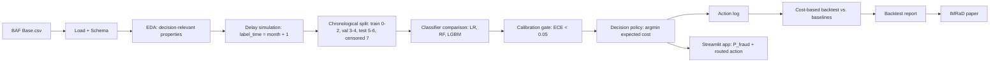

# First-Principles Problem Decomposition

> **Repository:** `delayed-label-fraud-decisioning`  
> **Course:** Introduction to Machine Learning — Final Group Project  
> **Institution:** National University Philippines  
> **Instructor:** Ken Oliver Caparros  
> **Document:** First-Principles Problem Decomposition  
> **Status:** v1.0 — derivation behind the decision-centric framing  
> **Last updated:** 2026-09-25

---

## 0. Purpose and Relationship to Other Documents

This document is the **first-principles derivation** behind
`docs/problem_framing.md` v1.0. It answers a single question:

> Starting only from what is structurally true about real-time fraud
> decisioning, what must the project be?

It is not a replacement for `problem_framing.md`. It is the reasoning that
produces it. If the two documents disagree, `problem_framing.md` is the
charter and wins; this document is then updated.

**Rule:** No model, metric, split, or deliverable is allowed into the
project unless it can be traced to a layer in this decomposition.

**Rule:** Every inherited assumption — from the course PDF, from common ML
practice, or from the original project plan — is treated as suspect until
it survives the decomposition below.

---

## 1. Method

First-principles thinking for this project means:

1. Start from the **real-world pain point**, not from a model.
2. Identify the **fundamental constraints** that cannot be optimized away.
3. Express the problem as a **decision under uncertainty**.
4. Derive the **mathematical objective** from the pain point.
5. Identify the **data-generating process**, including delay and censoring.
6. Derive **evaluation** from the objective, not from convention.
7. Only then choose a **model**, and only as an input to the decision.
8. Reject any component that does not serve the objective.

The decomposition proceeds in layers. Each layer follows from the one above
it. Nothing is included because a deliverable required it; everything is
included because the problem required it.

---

## 2. First-Principles Decomposition

| Layer | Question | Answer | What it justifies |
|---|---|---|---|
| **0. Fact** | What is structurally true? | A transaction must be authorized or declined before its label exists. | Everything downstream. |
| **1. Consequence** | What does that force? | Labels are delayed, censored, and noisy. | Delay simulation; censored-label handling; temporal evaluation. |
| **2. Objective** | What is actually being optimized? | Realized operational cost. | Cost matrix; cost-based metrics; backtest. |
| **3. Decision** | What actions are available? | `approve`, `review`, `block`. | Decision policy; expected-cost formulation. |
| **4. Input** | What does the decision need? | A calibrated `P(fraud)`. | Classifier; calibration gate. |
| **5. Method** | How is the classifier chosen? | Compare traditional classifiers as policy inputs. | Three-algorithm comparison. |
| **6. Evaluation** | How do we know if it works? | Realized cost per transaction on a temporal backtest vs. baselines. | Evaluation protocol; backtest report. |
| **7. Deployment** | How is it used? | An interactive application showing `P(fraud)` and the routed action. | Streamlit app. |
| **8. Reporting** | How is it communicated? | IMRaD paper and supporting documentation. | Paper; data dictionary; technical docs. |

Course deliverables — three algorithms, EDA, Streamlit app, IMRaD paper —
appear at layers 5, 7, 4, and 8. They are **instruments** for answering the
question at layers 2–3. They are not the question.

---

### 2.1 Layer 0 — The Structural Fact

**Question:** What is true regardless of dataset or model choice?

**Answer:** In real-time payment systems, authorization happens before the
outcome is known.

```text
decision_time = t
label_time    = t + Δ_t        where Δ_t > 0
```

This is not a modeling choice. It is the shape of the domain. It cannot be
optimized away by a better classifier, a larger dataset, or a more complex
architecture.

**What it forbids:**

- Assuming the label is available at decision time.
- Random train/test splits that ignore time.
- Treating the problem as a standard supervised classification task.

**What it justifies:**

- A temporal, delay-aware problem framing.
- A decision-centric objective.
- A classifier whose output is an input to a policy, not the product.

---

### 2.2 Layer 1 — The Consequence

**Question:** What does the structural fact force?

**Answer:** The label is late, noisy, and sometimes missing.

```text
Δ_t > 0
```

Consequences:

| Consequence | Meaning |
|---|---|
| Label delay | The label arrives after the decision. |
| Censoring | Some fraud is never reported. |
| Label noise | Some disputes are not fraud; some fraud is not disputed. |
| Class imbalance | Fraud is rare relative to legitimate traffic. |
| Cost asymmetry | A missed fraud and a blocked customer do not cost the same. |
| Concept drift | Fraud patterns change over time. |
| Adversarial adaptation | Fraudsters adapt to the model. |

**What it forbids:**

- Treating censored labels as negatives.
- Using future information as a feature.
- Evaluating with a random split.
- Reporting accuracy as the primary criterion.

**What it justifies:**

- A 1-month delay regime: `label_time = month + 1`.
- Censored rows excluded and counted.
- Chronological train / validation / test splits.
- A cost-sensitive objective.
- Sensitivity analysis over cost assumptions.

---

### 2.3 Layer 2 — The Objective

**Question:** What is the system actually optimizing?

**Answer:** Realized operational cost.

Formally, for each transaction:

```text
action* = argmin over {approve, review, block} of E[cost(action)]
```

with:

```text
E[cost(approve)] = p * fraud_loss(amount)
E[cost(review)]  = review_cost + p * residual_fraud_loss
E[cost(block)]   = (1 - p) * false_positive_cost
```

where `p = P(y = 1 | X_t)` is the calibrated model output.

**Why not classification metrics:**

| Metric | What it measures | Why it is not the objective |
|---|---|---|
| Accuracy | Fraction correct | Useless at ~1.1% fraud rate; predict-all-legit scores ~98.9%. |
| ROC-AUC | Ranking quality across all thresholds | Ignores the cost matrix and calibration. |
| Macro F1 | Balanced precision/recall | Treats both error types as equally costly; they are not. |
| Recall@k | Coverage at fixed alert budget | Useful supporting metric; not a cost objective. |
| **Cost per transaction** | Mean realized cost of the policy | **This is the objective.** |

**What it forbids:**

- Selecting a classifier by macro F1 or ROC-AUC.
- Reporting accuracy as the primary success criterion.
- Tuning thresholds on the test window.

**What it justifies:**

- A frozen cost matrix in `configs/costs.yaml`.
- Realized cost per transaction as the primary metric.
- Classification metrics as supporting evidence only.

---

### 2.4 Layer 3 — The Decision

**Question:** What actions are available?

**Answer:** `approve`, `review`, `block`.

Three actions are used because:

- `approve` and `block` alone ignore review, which is where most real fraud
  operations live.
- Review is not free and not unlimited; the three-action formulation exposes
  the tradeoff.
- A three-action policy can express “this is uncertain enough to
  investigate.”

**Decision rule:**

```text
action* = argmin of E[cost(action)]
```

The argmin rule is the **source of truth**. Thresholds derived from the cost
matrix are a **diagnostic view** for reporting.

**What it forbids:**

- Treating a 0.5 probability threshold as the decision rule.
- Tuning thresholds on validation or test data.
- Using a learned policy, bandit, or RL in this submission.

**What it justifies:**

- `src/policy/decide.py` with a pure `choose_actions` function.
- An action log that records all three expected costs.
- Unit tests covering threshold edge cases.

---

### 2.5 Layer 4 — The Input

**Question:** What does the decision need?

**Answer:** A calibrated probability `p = P(fraud | X_t)`.

The classifier has three requirements, in order of importance:

1. **Calibration.** `p` must be a real probability. The policy’s expected
   costs are linear in `p`. ECE < 0.05 is required, or one calibration step
   must bring it below.
2. **Ranking.** Among transactions with the same score, fraud must be more
   likely than non-fraud. ROC-AUC is supporting evidence.
3. **Speed.** The classifier must run in real time.

**What it forbids:**

- Deploying an uncalibrated score into the policy.
- Distorting calibrated probabilities with aggressive resampling.
- Using a classifier that fails the calibration gate without a documented
  calibration step.

**What it justifies:**

- A calibration gate: ECE < 0.05 on validation.
- Reporting Brier and ECE for every classifier.
- Using raw LightGBM output directly when ECE passes.

**Current evidence:** ECE = 0.0033. Gate passed. No calibration step applied.

---

### 2.6 Layer 5 — The Method

**Question:** How is the classifier chosen?

**Answer:** Compare traditional classifiers as **policy inputs**, not as
classification leaders.

Classifiers compared:

| Algorithm | Role | Why included |
|---|---|---|
| Logistic Regression | Linear baseline | Interpretable; fast; well-understood reference. |
| Random Forest | Non-linear ensemble | Handles mixed types and interactions. |
| LightGBM | Gradient boosting | Strong tabular performance; native categorical handling. |

**Fairness conditions:**

- Same split: train 0–2, validation 3–4, test 5–6.
- Same preprocessing, fit within each training fold only.
- Same cross-validation folds: expanding-window by month.
- Same evaluation criterion: validation realized cost after the policy.
- Documented hyperparameter grids.
- Test set used once, after selection.

**Selection rule:**

A classifier selection counts as a finding only if:

1. The top classifier wins every fold, **and**
2. The gap to the runner-up exceeds 5% relative.

Otherwise, the result is a non-finding and the simplest model is selected.

**Current evidence:**

| Classifier | CV realized cost (mean ± SD) |
|---|---:|
| LightGBM | 0.005852 ± 0.000300 |
| Logistic Regression | 0.005915 ± 0.000338 |
| Random Forest | 0.006515 ± 0.000579 |

- Top gap: 0.000063 → 1.07% relative.
- Threshold: 5%.
- Result: non-finding.
- Decision: Logistic Regression selected by simplicity.

**What it forbids:**

- Selecting a classifier by macro F1.
- Counting hyperparameter variants as distinct algorithms.
- Neural networks, deep learning, transformers, LLMs, AutoML.
- Test-window tuning.

**What it justifies:**

- The three-algorithm comparison.
- The noise-band guard on classifier selection.
- Documented hyperparameter grids.

---

### 2.7 Layer 6 — Evaluation

**Question:** How do we know if the system works?

**Answer:** Realized cost per transaction on a temporal backtest, compared
against canonical baselines.

**Primary metric:**

```text
realized cost per transaction
    on the test window,
    under the frozen cost matrix,
    under the 1-month delay regime.
```

**Supporting metrics:**

| Metric | Purpose |
|---|---|
| Bootstrap CI on advantage | Statistical validity |
| Sensitivity minimum | Robustness to cost assumptions |
| ECE / Brier | Calibration |
| Precision@1/5/10%, Recall@1/5/10% | Ranking context |
| Macro F1, ROC-AUC, confusion matrix | Classification context only |
| Censored count and rate | Data integrity |

**Baselines:**

1. Random decision (seeded)
2. Approve-all
3. Block-all
4. LR + static 0.5
5. RF + static 0.5
6. LGBM + static 0.5
7. Cost-sensitive policy (system under test)

The policy is compared against the **strongest** baseline, not the weakest.

**Stop criteria:**

- **Success stop:** CI excludes zero and relative reduction > 5%.
- **Null stop:** inside noise band or below effect size.
- **Blocked stop:** prerequisite missing.
- **Scope stop:** out of submission scope.

**Current evidence:**

| Quantity | Value |
|---|---:|
| Policy cost/txn | 0.007491 |
| Strongest baseline | 0.018737 |
| Advantage | 60.02% |
| Bootstrap CI | [56.00%, 64.16%] |
| Sensitivity minimum | 50.38% at `review_cost=0.04` |
| Calibration ECE | 0.0033 |
| Test rows | 227,491 |
| Censored rows | 96,843 (9.68%) |

**What it forbids:**

- Random splits on temporal data.
- K-fold CV that mixes time boundaries.
- Test-window tuning of any kind.
- Treating censored labels as negatives.
- Reporting a non-finding as a finding.

**What it justifies:**

- The evaluation protocol.
- The backtest report.
- The IMRaD paper’s results section.

---

### 2.8 Layer 7 — Deployment

**Question:** How is the system used?

**Answer:** An interactive application that shows both `P(fraud)` and the
routed action.

The app is a **decision system**, not a classifier demo. It must:

- Load the same classifier and preprocessing pipeline reported in the paper.
- Accept validated input.
- Display `p_fraud` and the routed action.
- Show the cost reasoning behind the action.
- Handle invalid, missing, and out-of-range inputs gracefully.

**What it forbids:**

- Showing only a probability.
- Using a different model than the paper reports.
- Crashing on invalid input.

**What it justifies:**

- `app/streamlit_app.py`.
- The deployed public URL.
- App validation tests.

**Current evidence:** deployed app verified; batch upload 500 rows → policy
cost 3.80 vs approve-all 9.87 → 61.5% savings.

---

### 2.9 Layer 8 — Reporting

**Question:** How is it communicated?

**Answer:** An IMRaD paper in IEEE format, plus supporting documentation.

The paper must report:

- The framing.
- The method.
- The results.
- The limitations.
- Censored count.
- Bootstrap CI.
- Sensitivity minimum.
- Failure analysis.
- Stop verdict.

**What it forbids:**

- Reporting a classification metric as the primary success criterion.
- Omitting limitations.
- Overclaiming delayed-label learning.

**What it justifies:**

- `paper/paper_imrad.md`.
- `paper/paper.docx`, `paper/paper.pdf`.
- Data dictionary, technical documentation, contribution record, ownership
  declaration.

---

## 3. Fundamental Constraints

These constraints are not choices. They are properties of the problem, the
dataset, or the course.

| Constraint | Source | Consequence |
|---|---|---|
| Decision precedes label | Domain | Temporal evaluation; decision policy. |
| Month-level granularity | BAF dataset | 1-month delay regime only. |
| Censored month 7 | BAF dataset | Exclude and report; never negative. |
| Fraud rate ~1.1% | BAF dataset | Cost-based evaluation; no accuracy. |
| Synthetic data | BAF dataset | Named limitation; no production claim. |
| Cost asymmetry | Domain | Cost matrix; argmin policy. |
| Review is finite | Domain | Capacity deferred; named. |
| Traditional classifiers only | Course | LR, RF, LGBM. |
| Three algorithms | Course | Comparison as policy inputs. |
| Streamlit app | Course | Decision system, not classifier demo. |
| IMRaD paper | Course | Reporting requirement. |

---

## 4. Assumptions Audit

Every inherited assumption is either justified, modified, or rejected.

| Assumption | Source | Status | Resolution |
|---|---|---|---|
| Random split is acceptable | Common ML practice | Rejected | Temporal data requires chronological split. |
| Accuracy is the objective | Common ML practice | Rejected | Cost asymmetry; accuracy useless at 1.1% fraud. |
| Macro F1 is the selection criterion | Original PDF framing | Rejected | Selection by realized cost after policy. |
| Labels are available at decision time | Original PDF framing | Rejected | 1-month delay simulated. |
| Censored labels are negatives | Common ML practice | Rejected | Excluded and counted. |
| Review is free | Simplification | Rejected | `review_cost` in cost matrix. |
| Fraud loss is constant | Simplification | Modified | Amount-scaled `fraud_loss` adopted. |
| Deep learning is needed | Common ML practice | Rejected | Baseline-first; traditional classifiers only. |
| More complex is better | Common ML practice | Rejected | Complexity only against measured failure. |
| 0.5 threshold is the decision | Common ML practice | Rejected | Argmin expected cost is source of truth. |
| Test set can be used for tuning | Common ML practice | Rejected | Test window touched once. |
| Multiple delay regimes are required | Original PDF framing | Rejected | 1-month regime only; month granularity. |
| Rule-based threshold baseline is required | Original PDF framing | Deferred | Not needed for the decision question. |
| Capacity-aware scheduling is required | Original PDF framing | Deferred | Named; not implemented. |
| Fairness constraints are required | Original PDF framing | Deferred | Named; not implemented. |

---

## 5. Mathematical Formulation

### 5.1 Probability

```text
p = P(y = 1 | X_t)
```

where `X_t` contains only information available at decision time.

### 5.2 Expected Cost

```text
E[cost(approve)] = p * fraud_loss(amount)
E[cost(review)]  = review_cost + p * residual_fraud_loss
E[cost(block)]   = (1 - p) * false_positive_cost
```

### 5.3 Decision Rule

```text
action* = argmin over {approve, review, block} of E[cost(action)]
```

### 5.4 Amount Scaling

When `amount_scaled: true`:

```text
fraud_loss(amount) = amount * fraud_loss_rate
```

Rate calibration uses training-window amounts only:

```text
fraud_loss_rate = 1 / mean(amount_proxy on train)
                = 1 / 521.1626
                = 0.0019187869
```

### 5.5 Derived Thresholds (Diagnostic Only)

```text
p_review = review_cost / (fraud_loss - residual_fraud_loss)
p_block  = (false_positive_cost - review_cost) / (false_positive_cost + residual_fraud_loss)
```

The argmin rule is always well-defined, even when these thresholds
degenerate.

### 5.6 Edge Cases

| Case | Condition | Resolution |
|---|---|---|
| A | `fraud_loss <= residual_fraud_loss` | Review never cheaper; argmin reduces to approve-vs-block. |
| B | `p_review >= p_block` | Review band empty; argmin handles correctly. |
| C | Thresholds outside [0, 1] | Corresponding band vanishes; argmin still applies. |

All cases are covered by unit tests in `tests/test_policy.py`.

---

## 6. Decision Problem vs Classification Problem

| Dimension | Classification framing | Decision framing (this project) |
|---|---|---|
| Output | Predicted class | Action: approve / review / block |
| Objective | Accuracy, F1, AUC | Realized operational cost |
| Error treatment | Symmetric | Asymmetric |
| Threshold | Arbitrary or tuned | Derived from cost matrix |
| Label timing | Assumed available | Delayed and censored |
| Evaluation | Random split | Chronological backtest |
| Product | Classifier | Policy |
| Classifier role | The product | An input |

This project is a **decision problem**. The classifier is an input.

---

## 7. Data-Generating Process

### 7.1 Dataset

| Field | Value |
|---|---|
| Name | Bank Account Fraud (BAF) Suite |
| Version | v1, NeurIPS 2022 |
| Rows | 1,000,000 |
| Raw columns | 32 |
| Target | `fraud_bool` |
| Time column | `month`, 0–7 |
| Granularity | Month-level only |
| Overall fraud rate | 1.1029% |
| License | CC BY 4.0 |

### 7.2 Delay Simulation

```text
decision_time = month
label_time    = month + 1
observed      = label_time <= 7
```

Month 7 is censored, not negative.

### 7.3 Chronological Split

| Split | Months | Rows | Fraud rate | Purpose |
|---|---|---:|---:|---|
| Train | 0, 1, 2 | 397,039 | ~1.10% | Fit classifier and preprocessing |
| Validation | 3, 4 | 278,627 | 1.0207% | Calibration gate, hyperparameter selection |
| Test | 5, 6 | 227,491 | 1.2576% | Policy evaluation, backtest |
| Censored | 7 | 96,843 | — | Excluded; counted |

Assertion: `train + val + test == observed`.

### 7.4 Observed Drift

The test-window fraud rate (1.2576%) is higher than the training-window rate
(~1.10%). This is documented as a limitation, not corrected. Correcting it
would amount to tuning on the test window.

---

## 8. Evaluation First Principles

### 8.1 Primary Metric

Realized cost per transaction on the test window.

### 8.2 Statistical Rigor

- 1,000 bootstrap resamples, seed 42.
- 95% CI on the advantage.
- Minimum effect size: 5% relative reduction.

### 8.3 Sensitivity

Each cost parameter varied over a 2× range. The advantage must survive the
sweep.

### 8.4 Calibration

ECE < 0.05 on validation, or one calibration method must bring it below.

### 8.5 Current As-Built Evidence

| Fact | Value |
|---|---|
| Selected classifier | LogisticRegression (`C=10.0`, `max_iter=1000`) |
| Selection rule | Noise-band guard: 1.07% < 5% → non-finding → simplicity |
| Policy cost/txn | 0.007491 |
| Strongest baseline | 0.018737 |
| Advantage | 60.02% |
| Bootstrap CI | [56.00%, 64.16%] |
| Sensitivity minimum | 50.38% at `review_cost=0.04` |
| Calibration ECE | 0.0033 |
| Test rows | 227,491 |
| Censored rows | 96,843 (9.68%) |
| Tests passing | 58 / 58 |

---

## 9. System Architecture From First Principles



There is **one** pipeline. The classifier comparison is a step inside the
decision pipeline. It exists to answer: *which classifier, when fed into the
policy, produces the lowest realized cost?*

---

## 10. What Is In Scope

The following are in scope because the decomposition requires them.

**Framing and evaluation**

- Decision-centric problem framing.
- Frozen cost matrix with documented assumptions.
- Chronological split with 1-month delay and censored-label handling.
- Calibration gate: ECE < 0.05.
- Cost-based backtest with canonical baselines.
- Bootstrap confidence intervals.
- 2× sensitivity sweep over cost parameters.

**Classification methodology**

- Logistic Regression, Random Forest, LightGBM.
- Identical preprocessing, folds, and split.
- Documented hyperparameters.
- Selection by validation realized cost after the policy.
- Noise-band guard on selection.

**Data understanding**

- EDA focused on amount distribution, class imbalance, temporal drift, and
  feature availability.
- Data dictionary with source-time availability per column.
- Leakage register.

**Deployment and reporting**

- Streamlit app showing `P(fraud)` and routed action.
- IMRaD paper in IEEE format.
- Technical documentation, contribution record, ownership declaration.
- Reproducibility from raw data, configs, and seeds.

---

## 11. What Is Out of Scope

The following are explicitly excluded. They are deferred, not denied.

- Neural networks, deep learning, transformers, LLMs, pretrained foundation
  models.
- AutoML.
- Streaming infrastructure.
- Service layer.
- Online learning.
- PU learning.
- Delayed-label correction models.
- Drift detectors.
- Graph neural networks or graph features.
- Federated learning.
- Capacity-aware scheduling.
- Fairness-aware policy constraints.
- Bandit or RL policies.
- Multiple delay regimes.
- Production bank integration.
- Real PII or live customer data.
- Novel algorithm research.

Each exclusion is justified by scope discipline, not by impossibility.

---

## 12. Traceability Matrix

| First-principles layer | Project artifact |
|---|---|
| Layer 0 — Fact | `problem_framing.md` §2.1 |
| Layer 1 — Consequence | `data_card.md` §5–6 |
| Layer 2 — Objective | `decision_policy.md` §5 |
| Layer 3 — Decision | `decision_policy.md` §3–5 |
| Layer 4 — Input | `evaluation_protocol.md` §7 |
| Layer 5 — Method | `evaluation_protocol.md` §5, §8 |
| Layer 6 — Evaluation | `evaluation_protocol.md` §10–14 |
| Layer 7 — Deployment | `mvp_architecture.md` §10 |
| Layer 8 — Reporting | `paper/paper_imrad.md` |

---

## 13. Current As-Built Evidence

This is the state of the system as of `2026-09-24.md`.

| Fact | Value |
|---|---|
| Pipeline | Unified decision pipeline |
| Selected classifier | LogisticRegression |
| Selection rule | Noise-band guard: LGBM vs LR gap 1.07% < 5% |
| Policy cost/txn | 0.007491 |
| Strongest baseline | 0.018737 |
| Policy advantage | 60.02% |
| Bootstrap CI | [56.00%, 64.16%] |
| Sensitivity minimum | 50.38% at `review_cost=0.04` |
| Calibration ECE | 0.0033 |
| Censored rows | 96,843 (9.68%) |
| Tests | 58 / 58 passing |
| App | Deployed and verified |

---

## 14. Guiding Rules

> The decision is the object of study. The classifier is an input. The
> backtest is the evidence. The cost matrix is the assumption. The paper is
> the argument.

> If a component does not change the report, it is not part of the pipeline.

> The test window is used once. No exceptions.

> A claim is only a finding if the 95% bootstrap CI on the cost advantage
> excludes zero and the relative reduction exceeds 5%. Everything else is a
> non-finding, reported as such.

> Complexity is only justified by a measured failure of the current system.

---

## 15. Changelog

| Date | Change | Reason |
|---|---|---|
| 2026-09-25 | v1.0 — first-principles decomposition created; decision-centric framing derived from structural fact; assumptions audit added; traceability matrix added; current as-built evidence recorded | Companion to `problem_framing.md` v1.0 and the unified pipeline |

---

## 16. References

- Jesus et al., “Turning the Tables: Biased, Imbalanced, Dynamic Tabular
  Datasets for ML Evaluation,” NeurIPS 2022. (BAF dataset)
- Elkan, “The Foundations of Cost-Sensitive Learning,” IJCAI 2001.
- Elkan & Noto, “Learning Classifiers from Only Positive and Unlabeled
  Data,” KDD 2008.
- Pedregosa et al., “Scikit-learn: Machine Learning in Python,” JMLR 2011.
- Ke et al., “LightGBM: A Highly Efficient Gradient Boosting Decision Tree,”
  NeurIPS 2017.
