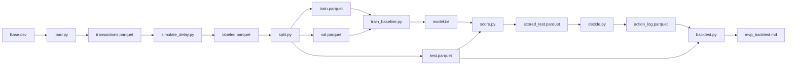

# MVP Architecture: 2-Week Deliverable

> **Repository:** `delayed-label-fraud-decisioning`  
> **Document:** MVP architecture for the 2-week build  
> **Status:** v0.2 — MVP complete (2026-09-21)  
> **Last updated:** 2026-09-21

---

## 1. Purpose

Define the **minimum end-to-end pipeline** required to produce the deliverable described in `mvp_2_weeks.md`.

This document is a **strict subset** of `architecture.md` v0.3. It drops every component that is not required to produce the MVP report. Anything not listed here is out of scope for the 2-week build.

**Rule:** If a file, schema, or component is not in this document, it is not part of the MVP pipeline.

---

## 2. Pipeline Overview



That is the entire MVP. Nine pipeline scripts, six data artifacts, one model file, one report. Two additional test files and one diagnostic script were added after the pipeline was validated (see Section 3).

---

## 3. Repository Layout (MVP)

```text
delayed-label-fraud-decisioning/
├── README.md
├── docs/
│   ├── mvp_2_weeks.md
│   └── mvp_architecture.md          <- this file
├── configs/
│   └── costs.yaml
├── data/
│   ├── raw/
│   │   └── baf/
│   │       └── Base.csv             # gitignored
│   ├── interim/
│   │   ├── transactions.parquet     # gitignored
│   │   └── labeled.parquet          # gitignored
│   └── processed/
│       ├── train.parquet            # gitignored
│       ├── val.parquet              # gitignored
│       ├── test.parquet             # gitignored
│       ├── scored_test.parquet      # gitignored
│       └── action_log.parquet       # gitignored
├── artifacts/
│   └── model.txt                    # gitignored
├── reports/
│   └── mvp_backtest.md              # committed
├── src/
│   ├── common.py                    # shared paths and feature exclusion list
│   ├── pipeline.py
│   ├── data/
│   │   ├── load.py
│   │   ├── simulate_delay.py
│   │   └── split.py
│   ├── models/
│   │   ├── train_baseline.py
│   │   └── score.py
│   ├── policy/
│   │   └── decide.py
│   └── evaluation/
│       ├── backtest.py
│       └── calibration.py           # ECE diagnostic, not in pipeline
└── tests/
    ├── test_policy.py
    └── test_backtest.py
```

`tests/` was optional per the original MVP scope. It was written on Day 1 because `decision_policy.md` §15 requires edge-case coverage of the argmin rule. The tests are pure-function tests — no dataset required, run in ~1.4 seconds.

---

## 4. Data Artifacts and Schemas

Every artifact is a Parquet file except the model and the report. Schemas are frozen for the MVP.

### 4.1 `data/interim/transactions.parquet`

Produced by `load.py`.

| Column | Type | Notes |
|---|---|---|
| `transaction_id` | int | Row index from Base.csv, unique |
| `month` | int | 0–7 |
| `fraud_bool` | int | 0/1 label |
| `amount_proxy` | float | `proposed_credit_limit` (documented proxy) |
| `feature_*` | mixed | All raw BAF features except excluded ones |

**Excluded from features:** `device_fraud_count` (post-decision risk), `fraud_bool` (label), `month` (time index used for splits).

### 4.2 `data/interim/labeled.parquet`

Produced by `simulate_delay.py`. Adds one column to 4.1.

| Column | Type | Notes |
|---|---|---|
| `label_month` | int | `month + 1` |
| `observed` | bool | `label_month <= 7` |

Rows with `observed == False` are censored.

### 4.3 `data/processed/{train,val,test}.parquet`

Produced by `split.py`. Same schema as 4.2, filtered by `month`:

| Split | Months |
|---|---|
| train | 0, 1, 2 |
| val | 3, 4 |
| test | 5, 6 |

Censored rows (`observed == False`) are excluded from all three.

### 4.4 `data/processed/scored_test.parquet`

Produced by `score.py`. Adds one column to test.parquet.

| Column | Type | Notes |
|---|---|---|
| `p_fraud` | float | Model output, in [0, 1] |

### 4.5 `data/processed/action_log.parquet`

Produced by `decide.py`.

| Column | Type | Notes |
|---|---|---|
| `transaction_id` | int | Join key |
| `month` | int | For grouping |
| `p_fraud` | float | Model output |
| `action` | string | `approve` / `review` / `block` |
| `expected_cost_approve` | float | For audit |
| `expected_cost_review` | float | For audit |
| `expected_cost_block` | float | For audit |
| `chosen_expected_cost` | float | Min of the three |
| `reason` | string | Which action won |

Labels are **not** in this file. They are joined in the backtest.

### 4.6 `artifacts/model.txt`

LightGBM model saved via `booster.save_model()`. No pickle. No wrapper.

---

## 5. Configuration

Only one config file is required for the MVP.

### `configs/costs.yaml`

```yaml
fraud_loss: 1.0
false_positive_cost: 0.1
review_cost: 0.02
residual_fraud_loss: 0.3
amount_scaled: true
fraud_loss_rate: 0.002067377733397323
```

The first four keys are the MVP cost matrix. `amount_scaled` and `fraud_loss_rate` were added after the MVP was validated, to support the amount-scaled sensitivity analysis required by `architecture.md` §9.2. When `amount_scaled: true`, `fraud_loss` becomes per-row: `fraud_loss(amount) = amount * fraud_loss_rate`. The rate was chosen so that `mean(fraud_loss_rate * amount_proxy) = 1.0` on the test set, keeping the comparison with constant `fraud_loss` apples-to-apples. The result was a success stop — the policy's advantage over the strongest baseline improved from 26.4% to 58.8%. See `reports/mvp_backtest.md` for the full sensitivity table.

No split config. No delay config. The MVP uses hardcoded values documented here and in `mvp_2_weeks.md`:

- Delay: 1 month
- Split: train 0–2, val 3–4, test 5–6
- Static threshold baseline: 0.5

If you change any of these, update this document first.

---

## 6. Component Specifications

Each component is a single script. Each has one job.

### 6.1 `src/data/load.py`

- **Input:** `data/raw/baf/Base.csv`
- **Output:** `data/interim/transactions.parquet`
- **Does:**
  - Reads Base.csv
  - Adds `transaction_id` = row index
  - Renames nothing; keeps BAF column names
  - Adds `amount_proxy` = `proposed_credit_limit`
  - Sorts by `month` (stable)
  - Writes Parquet
- **Does not:** drop features, impute, encode, split, or model

### 6.2 `src/data/simulate_delay.py`

- **Input:** `data/interim/transactions.parquet`
- **Output:** `data/interim/labeled.parquet`
- **Does:**
  - Adds `label_month = month + 1`
  - Adds `observed = label_month <= 7`
  - Writes Parquet
- **Does not:** sample delay, model delay, join labels

### 6.3 `src/data/split.py`

- **Input:** `data/interim/labeled.parquet`
- **Outputs:** `data/processed/{train,val,test}.parquet`
- **Does:**
  - Filters `observed == True`
  - Train: `month in {0,1,2}`
  - Val: `month in {3,4}`
  - Test: `month in {5,6}`
  - Writes Parquet
  - Prints censored count and rate
  - Asserts `train + val + test == observed`
- **Does not:** shuffle, resample, or stratify

### 6.4 `src/models/train_baseline.py`

- **Inputs:** `train.parquet`, `val.parquet`
- **Output:** `artifacts/model.txt`
- **Does:**
  - Trains LightGBM binary classifier with defaults
  - Early stopping on validation
  - Saves `booster.save_model('artifacts/model.txt')`
  - Prints train/val AUC and logloss
  - Converts object-dtype columns to pandas `category` with a shared train ∪ val category set
- **Does not:** tune, ensemble, calibrate

### 6.5 `src/models/score.py`

- **Inputs:** `test.parquet`, `artifacts/model.txt`
- **Output:** `scored_test.parquet`
- **Does:**
  - Loads model
  - Rebuilds the same category mapping used at training time (train ∪ val)
  - Computes `p_fraud`
  - Asserts `0 ≤ p_fraud ≤ 1`
  - Writes Parquet with `p_fraud` appended
- **Does not:** threshold, decide, log

### 6.6 `src/policy/decide.py`

- **Inputs:** `scored_test.parquet`, `configs/costs.yaml`
- **Output:** `action_log.parquet`
- **Does:**
  - For each row, computes three expected costs
  - Selects argmin
  - Writes action log with all three costs and chosen action
  - Handles `amount_scaled: true` by using per-row `fraud_loss = amount_proxy * fraud_loss_rate`
  - Exposes the argmin as a pure function `choose_actions(p, costs, amounts=None)` for testing
- **Does not:** use thresholds, tune, or apply capacity

### 6.7 `src/evaluation/backtest.py`

- **Inputs:** `action_log.parquet`, `test.parquet`, `configs/costs.yaml`
- **Output:** `reports/mvp_backtest.md`
- **Does:**
  - Joins on `transaction_id`
  - Computes realized cost for the policy
  - Computes realized cost for random, approve-all, block-all, static-0.5
  - Applies the same amount-scaled cost logic as `decide.py` when the flag is on
  - Computes precision@1%, recall@1%
  - Computes Brier score on `p_fraud`
  - Reports censored count and rate
  - Writes the report
- **Does not:** bootstrap, calibration curves

### 6.8 `src/evaluation/calibration.py`

- **Inputs:** `train.parquet`, `val.parquet`, `artifacts/model.txt`
- **Output:** prints ECE and a reliability table to stdout (no file written)
- **Does:**
  - Scores the validation set with the saved booster
  - Bins `p_fraud` into 10 quantile bins
  - Computes Expected Calibration Error (ECE)
  - Prints the stop-criterion verdict from `architecture.md` §9.2
- **Not in the pipeline.** This is a one-off diagnostic run manually. It is not part of `pipeline.py`.
- **Result on the current model:** ECE = 0.0040 (null stop — calibration is acceptable, no calibration step added).

### 6.9 `src/pipeline.py`

- **Input:** none
- **Output:** all of the above (except `calibration.py`)
- **Does:** runs each pipeline step in order with one command

---

## 7. The One Command

```bash
python -m src.pipeline
```

It runs, in order:

1. `load`
2. `simulate_delay`
3. `split`
4. `train_baseline`
5. `score`
6. `decide`
7. `backtest`

If any step fails, the pipeline fails loudly. Do not swallow errors.

`calibration.py` is not part of this command. Run it separately when you want the diagnostic.

---

## 8. Baseline Implementation Details

The four baselines are implemented in `backtest.py`. They use the same `test.parquet` and the same cost matrix.

| Baseline | Implementation |
|---|---|
| Random | `action = random.choice(['approve','review','block'])` per row, seeded |
| Approve-all | `action = 'approve'` for every row |
| Block-all | `action = 'block'` for every row |
| LightGBM + static 0.5 | `action = 'block' if p_fraud >= 0.5 else 'approve'` |

Realized cost per action uses the same cost matrix as the policy:

```text
fraud:   approve -> fraud_loss,    review -> review_cost + residual_fraud_loss,  block -> 0
legit:   approve -> 0,             review -> review_cost,                        block -> false_positive_cost
```

When `amount_scaled: true`, `fraud_loss` in the table above is per-row: `amount_proxy * fraud_loss_rate`.

---

## 9. What This MVP Architecture Does Not Include

- No `configs/splits.yaml`, `configs/delay.yaml`, `configs/policy.yaml`
- No action logging of `cost_config_hash`
- No calibration *step* (calibration was measured with ECE and passed; no Platt or isotonic adjustment was applied)
- No capacity simulation
- No rolling evaluation
- No full sensitivity analysis across all four cost keys (only amount scaling was tested)
- No config framework, plugin system, or service layer
- No MLflow, DVC, or W&B

Each of these exists in the full `architecture.md` v0.3 and can be added after the presentation.

---

## 10. Build Order

Follow this order. Do not skip ahead.

| Step | Script | Verify |
|---|---|---|
| 1 | `load.py` | `transactions.parquet` has 1,000,000 rows, 34 columns |
| 2 | `simulate_delay.py` | `labeled.parquet` has 2 new columns, observed count printed |
| 3 | `split.py` | train/val/test sizes add to observed total |
| 4 | `train_baseline.py` | val AUC reasonable (> 0.6), model file exists |
| 5 | `score.py` | `scored_test.parquet` has `p_fraud` in [0,1] |
| 6 | `decide.py` | `action_log.parquet` has all three actions present |
| 7 | `backtest.py` | `mvp_backtest.md` has five rows in the table |
| 8 | `pipeline.py` | One command reproduces everything from scratch |

Test each step manually before moving to the next. Do not build all seven and then debug.

---

## 11. Definition of Done (MVP Architecture)

- [x] `configs/costs.yaml` exists with 6 keys (four MVP cost keys plus `amount_scaled`, `fraud_loss_rate`)
- [x] `src/data/load.py` writes `transactions.parquet`
- [x] `src/data/simulate_delay.py` writes `labeled.parquet`
- [x] `src/data/split.py` writes train / val / test parquets
- [x] `src/models/train_baseline.py` writes `artifacts/model.txt`
- [x] `src/models/score.py` writes `scored_test.parquet`
- [x] `src/policy/decide.py` writes `action_log.parquet`
- [x] `src/evaluation/backtest.py` writes `reports/mvp_backtest.md`
- [x] `src/pipeline.py` runs all of the above with one command
- [x] `reports/mvp_backtest.md` contains the five-row comparison table
- [x] Censored-label count is reported
- [x] Brier score is reported
- [x] Amount-scaled fraud loss sensitivity run and adopted (success stop)
- [x] ECE calibration diagnostic run (null stop, ECE = 0.0040)
- [x] Policy argmin edge cases covered by unit tests (`tests/test_policy.py`)
- [x] Realized-cost matrix covered by unit tests (`tests/test_backtest.py`)

All boxes checked — MVP complete.

---

## 12. Relationship to the Full Architecture

| MVP (`mvp_architecture.md`) | Full (`architecture.md` v0.3) |
|---|---|
| 9 pipeline scripts + 2 test files + 1 diagnostic | More components |
| 1 delay regime | 2–3 regimes |
| 5 baselines | 6 baselines |
| Brier + ECE | Brier + ECE + calibration applied |
| Amount-scaled sensitivity (adopted) | Full cost matrix sensitivity |
| Stop criteria applied where relevant | Section 9 defines them all |
| Hardcoded split | `configs/splits.yaml` |
| No `cost_config_hash` | Full action log schema |

The MVP is a strict subset in structure. Two items from the full architecture's scope were pulled forward because they were cheap to add and their stop criteria were already written: amount-scaled sensitivity (`architecture.md` §9.2) and the ECE diagnostic (`architecture.md` §9.2). Both were evaluated against their stop criteria and reported. Nothing in the MVP contradicts the full architecture.

---

## 13. Guiding Rule

> Build the smallest correct loop. Ship it. Then expand.

If a component is not required to produce `reports/mvp_backtest.md`, it is not in the MVP.
