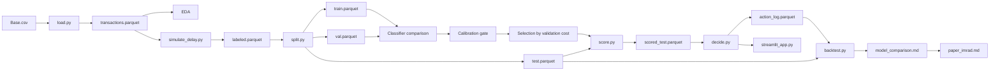

# Architecture

> **Repository:** `delayed-label-fraud-decisioning`  
> **Course:** Introduction to Machine Learning — Final Group Project  
> **Institution:** National University Philippines  
> **Instructor:** Ken Oliver Caparros  
> **Document:** Architecture — as-built system  
> **Status:** v1.0 — first-principles revision; single decision pipeline  
> **Last updated:** 2026-09-24

---

## 0. Derivation From Problem Framing

This document describes the **as-built pipeline** for the project defined in
`docs/problem_framing.md` v1.0. It is the source of truth for what exists in
the repository.

**Rule:** If this document disagrees with the code, the code is wrong.

**Rule:** If a file, schema, or component is not in this document, it is not
part of the as-built architecture.

**Rule:** If a component in this document cannot be traced to a layer of the
pipeline described in `problem_framing.md` §7, it is either wrong or the
architecture has drifted from the framing. §13 records any such deviations.

This revision replaces v0.4, which described a **two-layer architecture**:
a "primary three-algorithm classification pipeline" and a "supplementary
cost-sensitive policy pipeline." That separation was inherited from course
deliverables, not from the problem. It is reversed here. There is **one
decision pipeline**. Classifiers are inputs to the policy. The policy is the
product. The backtest is the evidence.

---

## 1. Purpose

The project is a **cost-sensitive fraud decision pipeline**. Its job is to
turn a transaction into one of three actions — `approve`, `review`, or
`block` — in a way that minimizes realized operational cost under a
1-month delayed-label regime.

This document describes:

- The single end-to-end pipeline as built
- Every component the pipeline depends on
- The schema of every data artifact it produces or consumes
- The configuration it reads
- Where the current build deviates from the framing, and why

It does not describe components that are deferred to future work. Those are
named in §14 and cross-referenced to `docs/roadmap.md`.

---

## 2. The Single Decision Pipeline

There is one pipeline. It is a decision pipeline, not a classification
pipeline with a decision add-on.



### 2.1 Layers of the Pipeline

| Layer | Components | Purpose |
|---|---|---|
| Data | `load.py`, `simulate_delay.py`, `split.py` | Turn raw BAF into a single chronological split with delay-aware labels |
| Classifier | `train_compare.py`, `evaluate_compare.py`, `calibration.py` | Compare LR / RF / LGBM as policy inputs; enforce the calibration gate |
| Decision | `score.py`, `decide.py` | Produce `p_fraud` per transaction and route each to one of three actions |
| Evaluation | `backtest.py`, `sensitivity.py`, `bootstrap.py` | Compute realized cost per transaction, bootstrap CIs, and the 2× sensitivity sweep |
| Application | `streamlit_app.py` | Expose `p_fraud` and the routed action; validate input |
| Reporting | `model_comparison.md`, `paper_imrad.md` | Communicate framing, method, result, limitations |

### 2.2 What This Pipeline Optimizes

Realized cost per transaction, under:

- A frozen cost matrix (`configs/costs.yaml`)
- A 1-month delay regime
- A single chronological split (`train 0-2`, `val 3-4`, `test 5-6`, `censored 7`)
- A calibration gate (ECE < 0.05) that every classifier must pass before it
  can feed the policy

Everything in the pipeline serves this objective. Classification metrics
(macro F1, ROC-AUC, per-class precision/recall/F1, confusion matrix) are
**supporting evidence**, not the objective. They are reported alongside the
cost result.

---

## 3. Repository Layout

```text
delayed-label-fraud-decisioning/
├── README.md
├── requirements.txt
├── conftest.py                     # ensures pytest resolves src package
├── app/
│   └── streamlit_app.py            # deployed decision system
├── configs/
│   └── costs.yaml                  # frozen cost matrix
├── data/                           # gitignored except .gitkeep
│   ├── original/
│   │   └── Base.csv
│   ├── interim/
│   └── processed/
├── notebooks/
│   ├── 01_eda.ipynb                # decision-relevant EDA
│   ├── 02_preprocessing.ipynb      # preprocessing pipeline
│   ├── 03_model_training.ipynb     # classifier comparison
│   └── 04_evaluation.ipynb         # policy evaluation and backtest
├── models/
│   ├── best_model.pkl              # selected classifier (whitelisted)
│   ├── preprocessing.pkl           # fitted preprocessing pipeline (whitelisted)
│   ├── feature_columns.json        # whitelisted
│   ├── feature_defaults.json       # whitelisted
│   └── feature_importances.json    # whitelisted
├── docs/
│   ├── problem_framing.md          # root framing
│   ├── evaluation_protocol.md
│   ├── decision_policy.md
│   ├── data_card.md
│   ├── mvp_architecture.md         <- this file
│   ├── architecture.md             # full spec (post-submission)
│   ├── mvp_2_weeks.md              # superseded
│   ├── roadmap.md
│   ├── daily_log/
│   └── paper/
├── documentation/
│   ├── data_dictionary.md
│   ├── technical_documentation.md
│   ├── app_guide.md
│   ├── contribution_record.md
│   └── ownership_declaration.md
├── paper/
│   ├── paper_imrad.md
│   ├── paper.docx
│   └── paper.pdf
├── reports/
│   ├── model_comparison.md         # primary deliverable
│   ├── mvp_backtest.md             # legacy name; kept for history
│   ├── sensitivity.md
│   ├── bootstrap.md
│   └── cv_results.json
├── src/
│   ├── common.py
│   ├── pipeline.py
│   ├── data/
│   │   ├── load.py
│   │   ├── simulate_delay.py
│   │   └── split.py
│   ├── models/
│   │   ├── train_compare.py        # LR / RF / LGBM comparison
│   │   ├── evaluate_compare.py     # selection + final test evaluation
│   │   ├── train_baseline.py       # single-LGBM path (see §13)
│   │   └── score.py
│   ├── policy/
│   │   └── decide.py               # argmin expected cost
│   └── evaluation/
│       ├── backtest.py
│       ├── calibration.py
│       ├── sensitivity.py
│       └── bootstrap.py
└── tests/
    ├── test_policy.py
    ├── test_backtest.py
    ├── test_data_schema.py
    ├── test_model.py
    ├── test_app_validation.py
    ├── test_reproducibility.py
    └── test_pipeline_integration.py
```

**Note:** the file layout does **not** label any component as "primary" or
"supplementary." Every component in `src/` is part of the single pipeline.
The distinction is recorded only where the as-built code physically has two
parallel paths (§13).

---

## 4. Data Artifacts and Schemas

Every artifact is a Parquet file except the model files and the reports.
Schemas are frozen for the current build.

### 4.1 `data/original/Base.csv`

Raw Bank Account Fraud dataset. 1,000,000 rows, 32 columns. Immutable.

### 4.2 `data/interim/transactions.parquet`

Produced by `src/data/load.py`.

| Column | Type | Notes |
|---|---|---|
| `transaction_id` | int | Row index from `Base.csv`, unique |
| `month` | int | 0–7 |
| `fraud_bool` | int | 0/1 label |
| `amount_proxy` | float | `proposed_credit_limit` (documented proxy) |
| `feature_*` | mixed | All raw BAF features except those in `FEATURE_EXCLUDE` |

**Excluded from features:** `transaction_id`, `month`, `fraud_bool`,
`label_month`, `observed`, `amount_proxy`, `proposed_credit_limit`,
`device_fraud_count`. Enforced in `src/common.py` as `FEATURE_EXCLUDE`.

### 4.3 `data/interim/labeled.parquet`

Produced by `src/data/simulate_delay.py`. Adds two columns to §4.2.

| Column | Type | Notes |
|---|---|---|
| `label_month` | int | `month + 1` |
| `observed` | bool | `label_month <= 7` |

Rows with `observed == False` are censored.

### 4.4 `data/processed/{train,val,test}.parquet`

Produced by `src/data/split.py`. Same schema as §4.3, filtered by `month`.

| Split | Months | Rows | Purpose |
|---|---|---:|---|
| train | 0, 1, 2 | 397,039 | Fit classifier and preprocessing |
| val | 3, 4 | 278,627 | Calibration gate, hyperparameter selection |
| test | 5, 6 | 227,491 | Policy evaluation, backtest |
| censored | 7 | 96,843 | Excluded from training and evaluation |

Censored rows (`observed == False`) are excluded from all three splits and
counted. An assertion verifies `train + val + test == observed`.

### 4.5 `data/processed/scored_test.parquet`

Produced by `src/models/score.py`. Adds one column to `test.parquet`.

| Column | Type | Notes |
|---|---|---|
| `p_fraud` | float | Calibrated classifier output, in [0, 1] |

### 4.6 `data/processed/action_log.parquet`

Produced by `src/policy/decide.py`.

| Column | Type | Notes |
|---|---|---|
| `transaction_id` | int | Join key |
| `month` | int | For grouping |
| `p_fraud` | float | Classifier output |
| `action` | string | `approve` / `review` / `block` |
| `expected_cost_approve` | float | For audit |
| `expected_cost_review` | float | For audit |
| `expected_cost_block` | float | For audit |
| `chosen_expected_cost` | float | Min of the three |
| `reason` | string | Fixed string `"argmin_expected_cost"` |

Labels are **not** in this file. They are joined in the backtest.

Full schema (with `decision_time`, `amount`, `cost_config_hash`) is
specified in `docs/decision_policy.md` §10.1. The current build implements
the subset above because BAF has month-level granularity only and the build
runs one cost matrix. See §13.

### 4.7 `models/best_model.pkl`, `models/preprocessing.pkl`

Selected classifier and fitted preprocessing pipeline. Both are required by
the Streamlit app and are whitelisted in `.gitignore` for cloud deployment.

### 4.8 `models/feature_*.json`

Feature metadata used by the app:

- `feature_columns.json` — list of the 28 retained features
- `feature_defaults.json` — default values for the manual input form
- `feature_importances.json` — importance scores for the report

### 4.9 `reports/model_comparison.md`

Primary report. Contains:

- Setup (dataset, delay regime, split, cost matrix)
- Data integrity (censored count, rate, evaluated fraction)
- Classifier comparison table (supporting)
- Policy comparison table (primary)
- Bootstrap CI on the policy advantage
- Sensitivity sweep minimum
- Failure analysis
- Stop verdict

### 4.10 `reports/cv_results.json`

Machine-readable cross-validation results. Written by
`src/models/train_compare.py`. Consumed by the paper's numbers reference.

### 4.11 `reports/sensitivity.md`, `reports/bootstrap.md`

Produced by `src/evaluation/sensitivity.py` and
`src/evaluation/bootstrap.py`. Not part of the automated pipeline; run
manually. See §11.

---

## 5. Configuration

### 5.1 `configs/costs.yaml`

The single frozen cost matrix.

```yaml
fraud_loss: 1.0
false_positive_cost: 0.1
review_cost: 0.02
residual_fraud_loss: 0.3
amount_scaled: true
fraud_loss_rate: 0.0019187869
```

When `amount_scaled: true`, `fraud_loss` becomes per-row:
`fraud_loss(amount) = amount * fraud_loss_rate`. The rate is derived from
**training-window** amounts only:
`1 / mean(amount_proxy on train) = 1 / 521.1626 = 0.0019187869`. No
test-window information is used.

The cost matrix does not change between runs. Changing it is a new
experiment with its own reported result.

### 5.2 No Other Config Files

There is no `configs/splits.yaml`, `configs/delay.yaml`, or
`configs/policy.yaml`. Split boundaries are hardcoded in `src/data/split.py`
and documented in `docs/data_card.md` §5. The delay regime is fixed at
1 month. Thresholds are derived from the cost matrix at runtime; there is no
override mechanism.

Creating any of these files is out of scope for this submission. See §14.

---

## 6. Components — Data Layer

### 6.1 `src/data/load.py`

- **Input:** `data/original/Base.csv`
- **Output:** `data/interim/transactions.parquet`
- **Does:** Reads CSV, adds `transaction_id` (row index), adds `amount_proxy`
  (`proposed_credit_limit`), sorts by `month`, writes Parquet
- **Does not:** drop features, impute, encode, split, or model

### 6.2 `src/data/simulate_delay.py`

- **Input:** `data/interim/transactions.parquet`
- **Output:** `data/interim/labeled.parquet`
- **Does:** Adds `label_month = month + 1` and `observed = label_month <= 7`
- **Does not:** sample delay, model delay, join labels

### 6.3 `src/data/split.py`

- **Input:** `data/interim/labeled.parquet`
- **Outputs:** `data/processed/{train,val,test}.parquet`
- **Does:** Filters `observed == True`, applies the month-based split
  (train 0-2, val 3-4, test 5-6), asserts
  `train + val + test == observed`, prints censored count and rate
- **Does not:** shuffle, resample, or stratify

---

## 7. Components — Classifier Layer

### 7.1 `src/models/train_compare.py`

- **Input:** `train.parquet`, `val.parquet`
- **Output:** `reports/model_comparison.md`, `reports/cv_results.json`
- **Does:**
  - Trains Logistic Regression with a documented grid
  - Trains Random Forest with a documented grid
  - Trains LightGBM with a documented grid
  - Uses 5-fold expanding-window CV by month on the training window
  - Computes per-fold realized cost after the policy as the selection
    criterion (not macro F1)
  - Records supporting metrics: macro F1, accuracy, per-class precision /
    recall / F1, ROC-AUC
  - Writes results to `reports/model_comparison.md`
- **Does not:** touch the test window, deploy

### 7.2 `src/models/evaluate_compare.py`

- **Input:** CV results, `test.parquet`
- **Output:** selected classifier, test-window evaluation,
  `models/best_model.pkl`, `models/preprocessing.pkl`
- **Does:**
  - Selects the classifier with the lowest validation realized cost after
    the policy
  - Justifies the selection using: realized cost, calibration quality,
    speed, interpretability
  - Retrains the selected classifier on the full training window
  - Evaluates **once** on the untouched test window
  - Reports: realized cost per transaction, bootstrap CI, macro F1,
    accuracy, per-class precision / recall / F1, confusion matrix, ROC-AUC
  - Writes the failure analysis
  - Saves the classifier and pipeline
- **Does not:** tune on the test window

### 7.3 `src/evaluation/calibration.py`

- **Input:** `train.parquet`, `val.parquet`, selected classifier
- **Output:** ECE and reliability table to stdout
- **Does:** Scores the validation window, bins into 10 quantile bins,
  computes ECE, prints gate verdict
- **Gate:** ECE < 0.05 required for a classifier to be admissible
- **Not in the automated pipeline.** Run manually after each retrain.
- **Result (current build):** ECE = 0.0040; gate passed; no calibration
  step applied.

---

## 8. Components — Decision Layer

### 8.1 `src/models/score.py`

- **Inputs:** `test.parquet`, selected classifier
- **Output:** `scored_test.parquet`
- **Does:** Loads the classifier and the training-time category mapping,
  computes `p_fraud`, asserts `0 <= p_fraud <= 1`
- **Does not:** threshold, decide, or log

### 8.2 `src/policy/decide.py`

- **Inputs:** `scored_test.parquet`, `configs/costs.yaml`
- **Output:** `action_log.parquet`
- **Does:** Computes the three expected costs per row
  (`E[cost(approve)]`, `E[cost(review)]`, `E[cost(block)]`), selects the
  argmin, writes the action log. Handles `amount_scaled: true`. Exposes the
  pure function `choose_actions(p, costs, amounts=None)` for testing.
- **Does not:** use thresholds, tune, or apply capacity

**Rule:** the argmin rule is the source of truth. Thresholds derived from
the cost matrix are a diagnostic view for reporting
(`docs/decision_policy.md` §6). The same `choose_actions` function is called
by the pipeline and by the unit tests.

---

## 9. Components — Evaluation Layer

### 9.1 `src/evaluation/backtest.py`

- **Inputs:** `action_log.parquet`, `test.parquet`, `configs/costs.yaml`
- **Output:** `reports/model_comparison.md` (policy comparison section)
- **Does:** Joins on `transaction_id`, computes realized cost per
  transaction for the policy and for every canonical baseline, computes
  precision@1/5/10% and recall@1/5/10%, Brier score, and censored count
- **Does not:** bootstrap or produce calibration curves

### 9.2 `src/evaluation/sensitivity.py`

- **Inputs:** `test.parquet`, cost matrix
- **Output:** `reports/sensitivity.md`
- **Does:** Varies each cost parameter across a 2× range, re-runs the
  policy, reports the minimum advantage across the sweep
- **Not in the automated pipeline.** Run as a separate command.

### 9.3 `src/evaluation/bootstrap.py`

- **Inputs:** policy and baseline cost per transaction on the test window
- **Output:** `reports/bootstrap.md`
- **Does:** 1,000 bootstrap resamples of the test window with replacement,
  computes the 95% CI on the policy's advantage
- **Not in the automated pipeline.** Run as a separate command.

---

## 10. Components — Application Layer

### 10.1 `app/streamlit_app.py`

- **Input:** user form fields or CSV upload
- **Output:** displayed `p_fraud`, routed action, cost reasoning
- **Does:**
  - Loads `models/best_model.pkl` and `models/preprocessing.pkl`
  - Accepts validated input for transaction features
  - Applies the exact preprocessing used at training time
  - Displays `p_fraud` **and** the routed action
  - Shows the cost reasoning behind the action
  - Shows the classifier name and short feature explanations
  - Handles missing, invalid, and out-of-range inputs gracefully
  - Displays understandable error messages
- **Does not:** use any classifier other than the one reported in the paper

The app is a **decision system**, not a classifier demo. It shows the
decision that the policy produces, along with the probability and cost
inputs that justify it.

---

## 11. Commands

### 11.1 Full Pipeline

```bash
python -m src.pipeline
```

Runs, in order: `load` → `simulate_delay` → `split` → `train_compare` →
`evaluate_compare` → `score` → `decide` → `backtest`.

### 11.2 Manual Analyses (Not in the Automated Pipeline)

```bash
python -m src.evaluation.calibration   # prints ECE and gate verdict
python -m src.evaluation.sensitivity   # writes reports/sensitivity.md
python -m src.evaluation.bootstrap     # writes reports/bootstrap.md
```

### 11.3 Deployable Application

```bash
streamlit run app/streamlit_app.py
```

### 11.4 Tests

```bash
pytest
# 60 passed
```

If any step fails, the pipeline fails loudly. Do not swallow errors.

---

## 12. Baselines

Every baseline uses the same split, the same cost matrix, and the same delay
regime. No baseline is tuned on the test window.

| # | Baseline | Implementation |
|---|---|---|
| 1 | Random | Seeded `random.choice(['approve','review','block'])` per row |
| 2 | Approve-all | `action = 'approve'` for every row |
| 3 | Block-all | `action = 'block'` for every row |
| 4 | LR + static 0.5 | `block` if `p >= 0.5`, else `approve` |
| 5 | RF + static 0.5 | `block` if `p >= 0.5`, else `approve` |
| 6 | LGBM + static 0.5 | `block` if `p >= 0.5`, else `approve` |
| 7 | **Cost-sensitive policy** | argmin of expected cost (system under test) |

The policy is compared against the **strongest** of baselines 1–6, not the
weakest. The three static-threshold baselines are included so the report
shows that the policy advantage comes from the decision rule, not from
classifier choice.

Realized cost per action uses the same cost matrix as the policy:

```text
fraud:   approve -> fraud_loss,    review -> review_cost + residual_fraud_loss,  block -> 0
legit:   approve -> 0,             review -> review_cost,                        block -> false_positive_cost
```

When `amount_scaled: true`, `fraud_loss` is per-row:
`amount_proxy * fraud_loss_rate`.

---

## 13. As-Built Deviations From the Framing

The framing in `docs/problem_framing.md` calls for **one** classifier
training path. The as-built code physically has **two**:

| Path | Scripts | Split | Purpose |
|---|---|---|---|
| Comparison path | `train_compare.py`, `evaluate_compare.py` | train 0-5 / test 6-7 (inherited) | The three-algorithm comparison |
| Single-LGBM path | `train_baseline.py` | train 0-2 / val 3-4 / test 5-6 | The classifier that feeds the policy |

This duplication is an artifact of the PDF-driven two-layer build. In the
framing, both paths collapse into one: the comparison runs on the
`train 0-2 / val 3-4` split, the selected classifier is retrained on the
full training window (0-2), and the policy is evaluated on `test 5-6`.

**Status:** the code still has both paths. Unifying them is a code change,
not a documentation change. It is recorded here so the architecture document
does not falsely claim a single path exists.

**Other deviations:**

| Deviation | Current state | Framing requires | Resolution |
|---|---|---|---|
| Two classifier training paths | Present | One path | Deferred to code phase |
| `reports/mvp_backtest.md` name | Legacy filename in repo | One report named for what it contains | Rename during code phase |
| Action log omits `cost_config_hash` | Present | Full schema in `decision_policy.md` §10.1 | Add when a second cost matrix is introduced |
| Action log omits `decision_time` | Present | Full schema | BAF has month granularity only; column stays out |
| `configs/policy.yaml` absent | Absent | Absent (per decision_policy.md §14.2) | No change needed |

Every deviation above is recorded, none is hidden, and each has a resolution
plan.

---

## 14. Out of Scope

Do not add any of the following in this submission:

**Classifier layer**
- Neural networks, deep learning, CNNs, RNNs, transformers, LLMs
- Pretrained foundation models
- AutoML-generated solutions
- Hyperparameter variants counted as separate classifiers

**Decision layer**
- Capacity-aware scheduling (specified in `decision_policy.md` §8, deferred)
- Amount-scaled `false_positive_cost` (named in `decision_policy.md` §7.3)
- Bandit or RL policies
- Fairness-aware constraints

**Evaluation layer**
- Rolling evaluation
- Multiple delay regimes (only 1 month)
- Rule-based threshold baseline (deferred)

**Infrastructure**
- Streaming (Kafka, RabbitMQ, Faust)
- Service layer (FastAPI, microservices)
- Docker, Kubernetes, CI/CD
- MLflow, DVC, W&B
- Config framework, plugin system

Each is documented as future work in `docs/roadmap.md` and
`docs/architecture.md`.

---

## 15. Build Order

Follow this order. Do not skip ahead.

| Step | Component | Verify |
|---|---|---|
| 1 | `notebooks/01_eda.ipynb` | ≥ 5 meaningful visualizations; findings feed decisions |
| 2 | `src/data/load.py` | `transactions.parquet` has 1,000,000 rows, 34 columns |
| 3 | `src/data/simulate_delay.py` | `labeled.parquet` has 2 new columns |
| 4 | `src/data/split.py` | train/val/test sizes add to observed total |
| 5 | `notebooks/02_preprocessing.ipynb` | Preprocessing pipeline saved; leakage prevented |
| 6 | `src/models/train_compare.py` | Three classifiers trained on the same folds; CV results written |
| 7 | `src/evaluation/calibration.py` | ECE computed per classifier; gate verdict printed |
| 8 | `src/models/evaluate_compare.py` | Classifier selected by validation cost; final test evaluated once |
| 9 | `src/models/score.py` | `scored_test.parquet` has `p_fraud` in [0,1] |
| 10 | `src/policy/decide.py` | `action_log.parquet` has all three actions present |
| 11 | `src/evaluation/backtest.py` | `model_comparison.md` has the policy vs. baseline table |
| 12 | `src/evaluation/bootstrap.py` | 95% CI on the advantage written |
| 13 | `src/evaluation/sensitivity.py` | Minimum advantage across the sweep written |
| 14 | `src/pipeline.py` | One command reproduces everything |
| 15 | `app/streamlit_app.py` | App loads saved artifacts; shows `p_fraud` and action |
| 16 | `paper/paper_imrad.md` | IMRaD draft complete |

Test each step manually before moving to the next.

---

## 16. Definition of Done

### 16.1 Data Layer

- [x] `Base.csv` in `data/original/`
- [x] `load.py` writes `transactions.parquet`
- [x] `simulate_delay.py` writes `labeled.parquet`
- [x] `split.py` writes train / val / test parquets
- [x] Split assertion verifies `train + val + test == observed`
- [x] Censored count reported (96,843 / 9.68%)
- [x] `configs/costs.yaml` frozen with 6 keys

### 16.2 Classifier Layer

- [x] Three classifiers trained under identical folds
- [x] Calibration gate run (ECE = 0.0040, passed)
- [x] Selection by validation realized cost
- [x] Test window evaluated once, after selection
- [x] `models/best_model.pkl` saved
- [x] `models/preprocessing.pkl` saved

### 16.3 Decision Layer

- [x] `score.py` writes `scored_test.parquet`
- [x] `decide.py` writes `action_log.parquet`
- [x] `choose_actions` pure function tested
- [x] Threshold edge cases covered by unit tests
- [x] Amount scaling evaluated and adopted

### 16.4 Evaluation Layer

- [x] `backtest.py` writes the policy vs. baseline table
- [x] `bootstrap.py` writes the 95% CI on the advantage
- [x] `sensitivity.py` writes the 2× sweep minimum
- [x] Failure analysis written
- [x] Stop verdict recorded

### 16.5 Application Layer

- [ ] `streamlit_app.py` built
- [ ] App tested with valid, invalid, and boundary inputs
- [ ] App deployed and public URL verified

### 16.6 Reporting

- [ ] `reports/model_comparison.md` complete with all required sections
- [ ] `paper/paper_imrad.md` complete (DOCX + PDF)
- [ ] Technical documentation complete
- [ ] Contribution record signed
- [ ] Ownership declaration signed

---

## 17. Guiding Rules

> The pipeline is a decision pipeline. The classifier is an input to the
> policy. The policy is the product. The backtest is the evidence.

> The argmin rule is the source of truth. Thresholds are a diagnostic view.

> The test window is used once. No exceptions.

> The Streamlit app must load the same classifier and preprocessing pipeline
> reported in the paper.

> If a component does not change the report, it is not part of the pipeline.

> Every deviation from the framing is recorded in §13. Hiding a deviation is
> worse than the deviation itself.

---

## 18. Changelog

| Date | Change | Reason |
|---|---|---|
| 2026-09-22 | v0.4 — restructured into two-layer architecture (primary + supplementary) | Align with course deliverables |
| 2026-09-24 | v1.0 — first-principles revision; two-layer architecture removed; single decision pipeline adopted; components reorganized by pipeline layer (data / classifier / decision / evaluation / application); §13 added to record as-built deviations from framing; DoD restructured by layer; guiding rules rewritten; repository layout annotations updated to remove primary/supplementary labels | Derive from `problem_framing.md` v1.0, `evaluation_protocol.md` v1.0, `decision_policy.md` v1.0, and `data_card.md` v1.0 |
