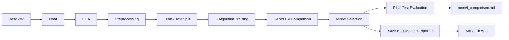
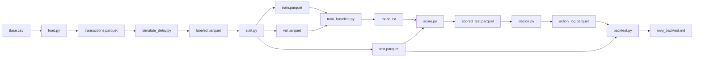

# Architecture

> **Repository:** `delayed-label-fraud-decisioning`  
> **Course:** Introduction to Machine Learning — Final Group Project  
> **Institution:** National University Philippines  
> **Instructor:** Ken Oliver Caparros  
> **Document:** Architecture — as-built system  
> **Status:** v0.4 — restructured around the course-required three-algorithm classification pipeline  
> **Last updated:** YYYY-MM-DD

---

## 1. Purpose

Define the **as-built end-to-end machine learning pipeline** for the course
final project, including both the primary classification deliverable and the
supplementary cost-sensitive decision analysis.

This document is the **source of truth for what exists in the repository**.
If this document disagrees with the code, the code is wrong.

**Rule:** If a file, schema, or component is not in this document, it is not
part of the as-built architecture.

---

## 2. Two-Layer Architecture

The project has two layers that share the same dataset and evaluation
discipline but serve different purposes.

| Layer | Purpose | Course role |
|---|---|---|
| **Primary** | Three-algorithm classification comparison on BAF | Required deliverable |
| **Supplementary** | Cost-sensitive decision policy under delayed labels | Project depth |

### 2.1 Primary Pipeline (Course Requirement)

The primary pipeline produces the three-algorithm comparison report and the
deployable Streamlit application. It follows the standard supervised learning
workflow required by the course.



### 2.2 Supplementary Pipeline (Project Depth)

The supplementary pipeline extends the selected classifier into a
cost-sensitive decision system evaluated under delayed labels.



### 2.3 Relationship Between the Two Layers

- Both layers use the **Bank Account Fraud (BAF) `Base.csv` dataset**.
- The primary layer uses a **chronological 80/20 split** with 5-fold
  time-series cross-validation.
- The supplementary layer uses a **chronological train / validation / test
  split** with a 1-month delay regime.
- The primary layer produces the **classification metrics** required by the
  course (Macro F1, per-class precision/recall/F1, confusion matrix, ROC-AUC).
- The supplementary layer produces the **cost-sensitive decision analysis**
  that demonstrates project depth (cost per transaction, fraud dollars saved,
  calibration, sensitivity).

The two layers are documented separately and reported separately. Neither
contradicts the other.

---

## 3. Repository Layout

```text
delayed-label-fraud-decisioning/
├── README.md
├── requirements.txt
├── conftest.py                     # ensures pytest resolves src package
├── app/
│   └── streamlit_app.py            # primary: deployed application
├── configs/
│   └── costs.yaml                  # supplementary: frozen cost matrix
├── data/                           # gitignored
│   ├── original/
│   │   └── Base.csv
│   └── processed/
├── notebooks/
│   ├── 01_eda.ipynb                # primary: exploratory data analysis
│   ├── 02_preprocessing.ipynb      # primary: preprocessing pipeline
│   ├── 03_model_training.ipynb     # primary: 3-algorithm training
│   └── 04_evaluation.ipynb         # primary: final evaluation
├── models/
│   ├── best_model.pkl              # primary: selected model
│   └── preprocessing.pkl           # primary: fitted preprocessing pipeline
├── docs/
│   ├── problem_framing.md
│   ├── data_card.md
│   ├── decision_policy.md
│   ├── evaluation_protocol.md
│   ├── architecture.md
│   ├── mvp_architecture.md          <- this file
│   ├── roadmap.md
│   ├── daily_log/
│   └── paper/
├── documentation/
│   ├── data_dictionary.md
│   ├── technical_documentation.md
│   ├── app_guide.md
│   ├── contribution_record.md
│   └── ownership_declaration.md
├── paper/
│   ├── paper_imrad.md
│   ├── paper.docx
│   └── paper.pdf
├── reports/
│   ├── model_comparison.md          # primary deliverable
│   ├── mvp_backtest.md              # supplementary deliverable
│   ├── sensitivity.md               # supplementary
│   └── bootstrap.md                 # supplementary
├── src/
│   ├── common.py
│   ├── pipeline.py
│   ├── data/
│   │   ├── load.py
│   │   ├── simulate_delay.py        # supplementary
│   │   └── split.py                 # supplementary
│   ├── models/
│   │   ├── train_baseline.py        # supplementary
│   │   ├── train_compare.py         # primary: 3-algorithm training
│   │   ├── evaluate_compare.py      # primary: comparison + selection
│   │   └── score.py                 # supplementary
│   ├── policy/
│   │   └── decide.py                # supplementary
│   └── evaluation/
│       ├── backtest.py              # supplementary
│       ├── calibration.py           # supplementary
│       ├── sensitivity.py           # supplementary
│       └── bootstrap.py             # supplementary
└── tests/
    ├── test_policy.py
    └── test_backtest.py
```

The `src/models/train_compare.py` and `src/models/evaluate_compare.py`
scripts are the **primary training and comparison scripts**. They did not
exist in the original MVP build (which only trained LightGBM) and are added
to satisfy the course requirement to compare exactly three algorithms.

---

## 4. Data Artifacts and Schemas

Every artifact is a Parquet file except the model files and the reports.
Schemas are frozen for the current build.

### 4.1 Primary Data Artifacts

#### 4.1.1 `data/processed/train.parquet` and `data/processed/test.parquet`

Produced by the primary splitter (chronological 80/20). Same raw schema as
the loaded BAF data, filtered by month.

| Split | Months | Approximate share |
|---|---|---|
| Train | 0, 1, 2, 3, 4, 5 | ~80% |
| Test | 6, 7 | ~20% |

Exact row counts are documented in `docs/data_card.md` §5 and
`reports/model_comparison.md`.

#### 4.1.2 `models/best_model.pkl`

The selected classifier after the three-algorithm comparison. Serialized
with `joblib` or `pickle`.

#### 4.1.3 `models/preprocessing.pkl`

The fitted preprocessing pipeline (encoders, scalers, feature list). Must be
loaded together with the model by the Streamlit app to guarantee identical
transformations.

#### 4.1.4 `reports/model_comparison.md`

The primary deliverable: cross-validation results for all three algorithms,
final test results for the selected model, confusion matrix, and failure
analysis.

### 4.2 Supplementary Data Artifacts

#### 4.2.1 `data/interim/transactions.parquet`

Produced by `load.py`.

| Column | Type | Notes |
|---|---|---|
| `transaction_id` | int | Row index from `Base.csv`, unique |
| `month` | int | 0–7 |
| `fraud_bool` | int | 0/1 label |
| `amount_proxy` | float | `proposed_credit_limit` (documented proxy) |
| `feature_*` | mixed | All raw BAF features except excluded ones |

**Excluded from features:** `device_fraud_count` (post-decision risk),
`fraud_bool` (label), `month` (time index used for splits).

#### 4.2.2 `data/interim/labeled.parquet`

Produced by `simulate_delay.py`. Adds two columns to 4.2.1.

| Column | Type | Notes |
|---|---|---|
| `label_month` | int | `month + 1` |
| `observed` | bool | `label_month <= 7` |

Rows with `observed == False` are censored.

#### 4.2.3 `data/processed/{train,val,test}.parquet`

Produced by `split.py`. Same schema as 4.2.2, filtered by `month`:

| Split | Months |
|---|---|
| train | 0, 1, 2 |
| val | 3, 4 |
| test | 5, 6 |

Censored rows (`observed == False`) are excluded from all three.

#### 4.2.4 `data/processed/scored_test.parquet`

Produced by `score.py`. Adds one column to `test.parquet`.

| Column | Type | Notes |
|---|---|---|
| `p_fraud` | float | Model output, in [0, 1] |

#### 4.2.5 `data/processed/action_log.parquet`

Produced by `decide.py`.

| Column | Type | Notes |
|---|---|---|
| `transaction_id` | int | Join key |
| `month` | int | For grouping |
| `p_fraud` | float | Model output |
| `action` | string | `approve` / `review` / `block` |
| `expected_cost_approve` | float | For audit |
| `expected_cost_review` | float | For audit |
| `expected_cost_block` | float | For audit |
| `chosen_expected_cost` | float | Min of the three |
| `reason` | string | Which action won |

Labels are **not** in this file. They are joined in the backtest.

#### 4.2.6 `artifacts/model.txt`

LightGBM model saved via `booster.save_model()`. Used only by the
supplementary pipeline. The primary pipeline saves the selected model
separately as `models/best_model.pkl`.

---

## 5. Configuration

### 5.1 `configs/costs.yaml` — supplementary

```yaml
fraud_loss: 1.0
false_positive_cost: 0.1
review_cost: 0.02
residual_fraud_loss: 0.3
amount_scaled: true
fraud_loss_rate: 0.0019187869
```

The first four keys are the constant-loss cost matrix. `amount_scaled` and
`fraud_loss_rate` were added after the constant-loss build was validated and
the amount-scaled sensitivity returned a success stop.

When `amount_scaled: true`, `fraud_loss` becomes per-row:
`fraud_loss(amount) = amount * fraud_loss_rate`. The rate is derived from
**training-window** amounts:
`1 / mean(amount_proxy on train) = 1 / 521.1626 = 0.0019187869`. This keeps
`mean(fraud_loss_rate * amount_proxy) = 1.0` on train, matching the
constant-loss comparison scale without test-window leakage.

### 5.2 Primary Configuration

The primary pipeline does not use a config file. Hyperparameters,
cross-validation folds, and the chronological split are documented in:

- `docs/data_card.md` §5 (split)
- `docs/evaluation_protocol.md` §4 (algorithms, preprocessing, metric)
- `reports/model_comparison.md` (final hyperparameters and results)

Hardcoded primary parameters:

- Chronological split: train months 0–5, test months 6–7
- Cross-validation: 5-fold time-series
- Primary metric: Macro F1
- Class imbalance handling: `class_weight='balanced'` (LR),
  `class_weight='balanced_subsample'` (RF), `is_unbalance=True` (LGBM)

If you change any of these, update `docs/evaluation_protocol.md` and
`docs/data_card.md` first.

---

## 6. Component Specifications — Primary

Each primary component is a script or notebook with one job.

### 6.1 `notebooks/01_eda.ipynb`

- **Input:** `data/original/Base.csv`
- **Output:** EDA findings, at least 5 visualizations, EDA summary
- **Does:**
  - Loads the dataset and reports dimensions, dtypes, summary statistics
  - Audits missing values, duplicates, impossible values
  - Plots univariate distributions of important variables
  - Analyzes relationships between features and target
  - Reports class distribution and imbalance
  - Investigates outliers
  - Documents every finding with a decision it drives
- **Does not:** train models, deploy anything
- **Findings feed:** preprocessing choices, feature selection, algorithm
  choice, evaluation strategy

### 6.2 `notebooks/02_preprocessing.ipynb`

- **Input:** raw data
- **Output:** documented preprocessing pipeline
- **Does:**
  - Handles missing values (documented per column)
  - Handles duplicates
  - Handles outliers (documented as error vs. legitimate extreme)
  - Encodes categoricals (method documented per algorithm)
  - Scales numerics where required (fit on train only)
  - Selects features (based on EDA findings)
  - Handles class imbalance (class weights, documented)
  - Saves the pipeline to `models/preprocessing.pkl`
- **Does not:** train models, evaluate

### 6.3 `notebooks/03_model_training.ipynb` and `src/models/train_compare.py`

- **Input:** preprocessed train data
- **Output:** CV results for all three algorithms
- **Does:**
  - Trains Logistic Regression with documented grid
  - Trains Random Forest with documented grid
  - Trains LightGBM with documented grid
  - Runs 5-fold time-series CV for each
  - Reports mean ± SD of Macro F1 per fold
  - Tracks supporting metrics: accuracy, per-class precision/recall/F1,
    ROC-AUC
  - Writes results to `reports/model_comparison.md`
- **Does not:** touch the test set, deploy

### 6.4 `notebooks/04_evaluation.ipynb` and `src/models/evaluate_compare.py`

- **Input:** CV results, test set
- **Output:** final selected model, test evaluation
- **Does:**
  - Selects the best model based on validation Macro F1
  - Justifies the selection using performance, interpretability, speed, and
    practical suitability
  - Retrains the selected model on the full training split
  - Evaluates **once** on the untouched test set
  - Reports: Macro F1, accuracy, per-class precision/recall/F1, confusion
    matrix, ROC-AUC
  - Writes failure analysis
  - Saves the final model to `models/best_model.pkl`
- **Does not:** tune on the test set

### 6.5 `app/streamlit_app.py`

- **Input:** user form fields or CSV upload
- **Output:** predicted class, probability, confidence indicator
- **Does:**
  - Loads `models/best_model.pkl` and `models/preprocessing.pkl`
  - Accepts validated input for transaction features
  - Applies the exact preprocessing used at training time
  - Displays predicted class (`fraud_bool`) and predicted probability
  - Shows the model name and short feature explanations
  - Handles missing, invalid, and out-of-range inputs gracefully
  - Displays understandable error messages
- **Does not:** use any model other than the one reported in the paper

---

## 7. Component Specifications — Supplementary

Each supplementary component is a single script with one job.

### 7.1 `src/data/load.py`

- **Input:** `data/original/Base.csv`
- **Output:** `data/interim/transactions.parquet`
- **Does:** Reads CSV, adds `transaction_id` (row index), adds `amount_proxy`
  (`proposed_credit_limit`), sorts by `month`, writes Parquet
- **Does not:** drop features, impute, encode, split, or model

### 7.2 `src/data/simulate_delay.py`

- **Input:** `data/interim/transactions.parquet`
- **Output:** `data/interim/labeled.parquet`
- **Does:** Adds `label_month = month + 1` and `observed = label_month <= 7`
- **Does not:** sample delay, model delay, join labels

### 7.3 `src/data/split.py`

- **Input:** `data/interim/labeled.parquet`
- **Outputs:** `data/processed/{train,val,test}.parquet`
- **Does:** Filters `observed == True`, applies month-based splits,
  asserts `train + val + test == observed`, prints censored count and rate
- **Does not:** shuffle, resample, or stratify

### 7.4 `src/models/train_baseline.py`

- **Inputs:** supplementary `train.parquet`, `val.parquet`
- **Output:** `artifacts/model.txt`
- **Does:** Trains LightGBM with defaults, early stopping on validation,
  saves booster, converts object columns to pandas `category`
- **Does not:** tune, ensemble, calibrate

### 7.5 `src/models/score.py`

- **Inputs:** supplementary `test.parquet`, `artifacts/model.txt`
- **Output:** `scored_test.parquet`
- **Does:** Loads model, rebuilds category mapping (train ∪ val), computes
  `p_fraud`, asserts `0 ≤ p_fraud ≤ 1`
- **Does not:** threshold, decide, log

### 7.6 `src/policy/decide.py`

- **Inputs:** `scored_test.parquet`, `configs/costs.yaml`
- **Output:** `action_log.parquet`
- **Does:** Computes three expected costs per row, selects argmin, writes
  action log, handles `amount_scaled: true`, exposes `choose_actions` pure
  function for testing
- **Does not:** use thresholds, tune, or apply capacity

### 7.7 `src/evaluation/backtest.py`

- **Inputs:** `action_log.parquet`, supplementary `test.parquet`,
  `configs/costs.yaml`
- **Output:** `reports/mvp_backtest.md`
- **Does:** Joins on `transaction_id`, computes realized cost for policy and
  baselines, computes precision/recall @ 1/5/10%, Brier score, censored
  count
- **Does not:** bootstrap, calibration curves

### 7.8 `src/evaluation/calibration.py`

- **Inputs:** supplementary `train.parquet`, `val.parquet`,
  `artifacts/model.txt`
- **Output:** ECE and reliability table to stdout
- **Does:** Scores validation set, bins into 10 quantile bins, computes ECE,
  prints stop-criterion verdict
- **Not in the pipeline.** Run manually.
- **Result:** ECE = 0.0040 (null stop — no calibration step added)

### 7.9 `src/evaluation/sensitivity.py`

- **Inputs:** test set + cost matrix
- **Output:** `reports/sensitivity.md`
- **Does:** Varies each cost parameter across a 2× range, recomputes policy
  advantage, reports minimum advantage
- **Not in the primary pipeline.** Run as a separate command.

### 7.10 `src/evaluation/bootstrap.py`

- **Inputs:** policy and baseline cost per transaction on the test set
- **Output:** `reports/bootstrap.md`
- **Does:** 1,000 bootstrap resamples of the test set, computes 95% CI on
  the policy's advantage
- **Not in the primary pipeline.** Run as a separate command.

### 7.11 `src/pipeline.py`

- **Input:** none
- **Output:** all supplementary pipeline artifacts
- **Does:** Runs supplementary steps in order: load → simulate_delay →
  split → train_baseline → score → decide → backtest
- **Not the primary command.** The primary pipeline is run through the
  notebooks + `src/models/train_compare.py` + `src/models/evaluate_compare.py`.

---

## 8. Commands

### 8.1 Primary Pipeline (Course Deliverable)

Run the notebooks in order:

```bash
jupyter notebook notebooks/01_eda.ipynb
jupyter notebook notebooks/02_preprocessing.ipynb
jupyter notebook notebooks/03_model_training.ipynb
jupyter notebook notebooks/04_evaluation.ipynb
```

Or, if scripted:

```bash
python -m src.models.train_compare    # writes reports/model_comparison.md
python -m src.models.evaluate_compare # writes final test results + best_model.pkl
```

### 8.2 Deployable Application

```bash
streamlit run app/streamlit_app.py
```

### 8.3 Supplementary Pipeline (Project Depth)

```bash
python -m src.pipeline
```

Runs, in order: load → simulate_delay → split → train_baseline → score →
decide → backtest.

### 8.4 Supplementary Analyses

```bash
python -m src.evaluation.sensitivity   # writes reports/sensitivity.md
python -m src.evaluation.bootstrap     # writes reports/bootstrap.md
```

### 8.5 Tests

```bash
pytest
# 13 passed in ~1.4s
```

If any step fails, the pipeline fails loudly. Do not swallow errors.

---

## 9. Baseline Implementation Details

### 9.1 Primary Baselines

For the primary three-algorithm comparison, the three algorithms serve as
each other's baselines. A trivial majority-class baseline is reported for
context.

| Baseline | Implementation |
|---|---|
| Majority class | `predicted = 0` for every row |
| Logistic Regression | Documented grid search |
| Random Forest | Documented grid search |
| LightGBM | Documented grid search |

### 9.2 Supplementary Baselines

Implemented in `backtest.py`. All use the same `test.parquet` and the same
cost matrix.

| Baseline | Implementation |
|---|---|
| Random | `random.choice(['approve','review','block'])` per row, seeded |
| Approve-all | `action = 'approve'` for every row |
| Block-all | `action = 'block'` for every row |
| LightGBM + static 0.5 | `action = 'block' if p_fraud >= 0.5 else 'approve'` |

Realized cost per action uses the same cost matrix as the policy:

```text
fraud:   approve -> fraud_loss,    review -> review_cost + residual_fraud_loss,  block -> 0
legit:   approve -> 0,             review -> review_cost,                        block -> false_positive_cost
```

When `amount_scaled: true`, `fraud_loss` in the table above is per-row:
`amount_proxy * fraud_loss_rate`.

---

## 10. What This Architecture Does Not Include

### 10.1 Out of Scope (Primary)

- Neural networks, deep learning, CNNs, RNNs, transformers, LLMs
- Pretrained foundation models
- AutoML-generated solutions
- Hyperparameter variants counted as separate algorithms
- Test-set tuning or threshold selection
- Accuracy-only evaluation

### 10.2 Out of Scope (Supplementary)

- `configs/splits.yaml`, `configs/delay.yaml`, `configs/policy.yaml`
- Action logging of `cost_config_hash`
- Calibration step (ECE passed; no Platt or isotonic applied)
- Capacity simulation
- Rolling evaluation
- Multiple delay regimes
- Rule-based threshold baseline
- Config framework, plugin system, service layer
- MLflow, DVC, W&B

Each of these is documented as future work in `docs/architecture.md` and can
be added after the course submission.

---

## 11. Build Order

Follow this order. Do not skip ahead.

### 11.1 Primary Build

| Step | Component | Verify |
|---|---|---|
| 1 | `notebooks/01_eda.ipynb` | ≥5 meaningful visualizations, findings feed decisions |
| 2 | `notebooks/02_preprocessing.ipynb` | Preprocessing pipeline saved, leakage prevented |
| 3 | `notebooks/03_model_training.ipynb` | 3 algorithms trained, CV results reported |
| 4 | `notebooks/04_evaluation.ipynb` | Best model selected, test evaluated once |
| 5 | `app/streamlit_app.py` | App loads saved model, handles inputs, displays prediction |
| 6 | `paper/paper_imrad.md` | IMRaD draft complete |

### 11.2 Supplementary Build

| Step | Component | Verify |
|---|---|---|
| 1 | `load.py` | `transactions.parquet` has 1,000,000 rows, 34 columns |
| 2 | `simulate_delay.py` | `labeled.parquet` has 2 new columns |
| 3 | `split.py` | train/val/test sizes add to observed total |
| 4 | `train_baseline.py` | val AUC > 0.6, model file exists |
| 5 | `score.py` | `scored_test.parquet` has `p_fraud` in [0,1] |
| 6 | `decide.py` | `action_log.parquet` has all three actions present |
| 7 | `backtest.py` | `mvp_backtest.md` has five rows in the table |
| 8 | `pipeline.py` | One command reproduces everything |

Test each step manually before moving to the next.

---

## 12. Definition of Done

### 12.1 Primary (Course Requirement)

- [ ] EDA notebook complete with ≥5 meaningful visualizations
- [ ] Data dictionary complete (`documentation/data_dictionary.md`)
- [ ] Preprocessing pipeline saved to `models/preprocessing.pkl`
- [ ] Chronological 80/20 split implemented
- [ ] 5-fold time-series CV implemented
- [ ] Logistic Regression trained and tuned
- [ ] Random Forest trained and tuned
- [ ] LightGBM trained and tuned
- [ ] Cross-validation results table complete (mean ± SD)
- [ ] Best model selected and justified
- [ ] Final test evaluation run once
- [ ] Confusion matrix and per-class metrics reported
- [ ] `reports/model_comparison.md` written
- [ ] `app/streamlit_app.py` built, tested, and deployed
- [ ] `paper/paper_imrad.md` written (DOCX + PDF)
- [ ] Technical documentation complete
- [ ] Contribution record and ownership declaration signed

### 12.2 Supplementary (Project Depth)

- [x] `configs/costs.yaml` exists with 6 keys
- [x] `src/data/load.py` writes `transactions.parquet`
- [x] `src/data/simulate_delay.py` writes `labeled.parquet`
- [x] `src/data/split.py` writes train / val / test parquets
- [x] `src/models/train_baseline.py` writes `artifacts/model.txt`
- [x] `src/models/score.py` writes `scored_test.parquet`
- [x] `src/policy/decide.py` writes `action_log.parquet`
- [x] `src/evaluation/backtest.py` writes `reports/mvp_backtest.md`
- [x] `src/pipeline.py` runs all of the above with one command
- [x] `reports/mvp_backtest.md` contains the five-row comparison table
- [x] Censored-label count is reported (96,843 / 9.68%)
- [x] Brier score is reported
- [x] Amount-scaled fraud loss sensitivity run and adopted
- [x] ECE calibration diagnostic run (null stop, ECE = 0.0040)
- [x] Policy argmin edge cases covered by unit tests
- [x] Realized-cost matrix covered by unit tests

---

## 13. Relationship to the Full Architecture Spec

| As-built (`mvp_architecture.md`) | Full spec (`docs/architecture.md`) |
|---|---|
| 9 supplementary scripts + primary notebooks | More components |
| 1 delay regime | 2–3 regimes |
| 5 supplementary baselines | 6 baselines |
| Brier + ECE | Brier + ECE + calibration applied |
| Amount-scaled sensitivity (adopted) | Full cost matrix sensitivity |
| Stop criteria applied where relevant | Section 9 defines them all |
| Hardcoded split | `configs/splits.yaml` |
| No `cost_config_hash` | Full action log schema |

The as-built system is a strict subset in structure. Two items from the full
spec were pulled forward because they were cheap to add and their stop
criteria were already written: amount-scaled sensitivity and the ECE
diagnostic. Both were evaluated against their stop criteria and reported.
Nothing in the as-built system contradicts the full spec.

---

## 14. Guiding Rules

### 14.1 Primary

> The three algorithms are only comparable if they use the **same split,
> same preprocessing, same folds, and same primary metric.**

> The test set is used **once**, after model selection. No exceptions.

> The Streamlit app must load the **same model and preprocessing pipeline**
> reported in the paper.

### 14.2 Supplementary

> Build the smallest correct loop. Ship it. Then expand.

> If a component is not required to produce `reports/mvp_backtest.md`, it is
> not part of the supplementary pipeline.

---

## 15. Changelog

| Date | Change | Reason |
|---|---|---|
| YYYY-MM-DD | Initial MVP architecture | Project start |
| 2026-09-21 | MVP complete: 9 pipeline scripts, 2 test files, 1 diagnostic; amount-scaled sensitivity adopted; ECE null stop recorded | Reconcile with built MVP |
| YYYY-MM-DD | Restructured into two-layer architecture (primary course pipeline + supplementary cost-sensitive pipeline); added EDA, preprocessing, three-algorithm comparison, Streamlit app, and IMRaD paper to primary scope; added repository layout matching required submission structure; added primary and supplementary build orders; split DoD into primary and supplementary | Align with course requirements |
