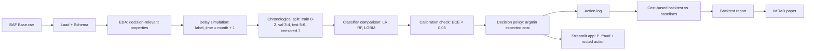

# Problem Framing: Delayed-Label Fraud Decisioning

> **Repository:** `delayed-label-fraud-decisioning`  
> **Course:** Introduction to Machine Learning — Final Group Project  
> **Institution:** National University Philippines  
> **Instructor:** Ken Oliver Caparros  
> **Document:** Problem framing / project charter  
> **Status:** v1.0 — first-principles revision; decision-centric framing  
> **Last updated:** 2026-09-24

---

## 0. How to Read This Document

This document is the **root** of the project. Every other document —
evaluation protocol, data card, decision policy, architecture, roadmap,
report, and paper — must derive from the problem decomposition and framing
stated here.

**Rule:** If another document contradicts this one, either this document is
wrong and must be revised, or that document is wrong and must be revised.
No third option.

**Rule:** If a component of the project cannot be traced to a sentence in
this document, that component is either unjustified or this document is
incomplete. Both are defects.

This revision replaces v0.3, which framed the project as a
classification-first study with a supplementary decision layer. That framing
was inherited from course deliverables rather than derived from the problem.
It is reversed here.

---

## 1. One-Sentence Project

Design, implement, and evaluate a **cost-sensitive fraud decision policy**
that decides `approve` / `review` / `block` in real time on the Bank Account
Fraud (BAF) dataset under a **delayed and censored label regime**, where
three traditional classifiers are compared as *inputs to the policy*, and
where success is measured by **realized operational cost**, not by
classification accuracy.

---

## 2. The Problem, Stated From First Principles

### 2.1 The Bare Fact

A payment transaction must be authorized or declined **before** anyone knows
whether it is fraudulent.

This is not a modeling choice. It is a structural property of every real-time
payment system. It cannot be optimized away.

### 2.2 The Consequence

The label that a supervised learning model needs — `y ∈ {0, 1}` — **does not
exist at decision time**. It arrives later, if it arrives at all:

```text
decision_time = t
label_time    = t + Δ_t        where Δ_t > 0
```

Sometimes `Δ_t` is a chargeback window. Sometimes the fraud is never
reported. Sometimes the customer disputes a legitimate charge. The label is
late, noisy, and missing-not-at-random.

### 2.3 The Therefore

Because labels arrive after the decision, and because both error types have
real costs:

- A **false negative** (approving fraud) costs the fraud amount.
- A **false positive** (blocking a legitimate transaction) costs customer
  friction, revenue, and churn.

...the operational problem is **not** "predict `y` accurately." It is:

> **Choose an action at decision time that minimizes expected operational
> cost, given a calibrated estimate of P(fraud), a cost structure, and the
> knowledge that the label is delayed and possibly censored.**

Classification accuracy is a **proxy** for this. It is not the objective.
Under class imbalance and cost asymmetry, it is a poor proxy.

### 2.4 The Real Research Question

> **How should a fraud system map a calibrated P(fraud) estimate into an
> operational `approve` / `review` / `block` decision in order to minimize
> realized cost under a delayed and censored label regime — and which
> traditional classifier produces the best policy input under this
> criterion?**

This is a **decision problem under uncertainty**, not a classification
problem. The classification model is an input. The policy is the object of
study. The backtest is the evidence.

---

## 3. First-Principles Decomposition

Each layer of the project derives from the layer above it. Nothing is
included because a deliverable required it; everything is included because
the problem required it.

| Layer | Question | Answer | What it justifies |
|---|---|---|---|
| **0. Fact** | What is structurally true? | Decisions must be made before labels arrive. | Everything downstream. |
| **1. Consequence** | What does that force? | Labels are delayed (`Δ_t > 0`), censored, and noisy. | Delay simulation; censored-label handling. |
| **2. Objective** | What is the system actually optimizing? | Minimize realized operational cost. | Cost matrix; cost-based metrics; backtest. |
| **3. Decision** | What actions are available? | `approve`, `review`, `block`. | Decision policy; expected-cost formulation. |
| **4. Input** | What does the decision need? | A calibrated P(fraud). | Classifier; calibration requirement. |
| **5. Method** | How do we choose a classifier? | Compare three traditional families under identical conditions. | Three-algorithm comparison (methodology). |
| **6. Evaluation** | How do we know if it works? | Realized cost per transaction, on a temporal backtest, vs. baselines. | Evaluation protocol; backtest report. |
| **7. Deployment** | How is it used? | An interactive application that shows both P(fraud) and the routed action. | Streamlit app. |
| **8. Reporting** | How is it communicated? | IMRaD paper, IEEE format. | Paper; documentation. |

**Course deliverables (three algorithms, Streamlit app, EDA, IMRaD) appear at
layers 5, 7, 4, and 8.** They are **instruments** for answering the question
at layers 2–3. They are not the question.

---

## 4. Why This Problem Exists

Modern payment systems separate four events that used to be one:

1. **Authorization** — the transaction is approved or declined, in
   milliseconds.
2. **Clearing** — funds move, often irrevocably on real-time rails (RTP,
   FedNow, UPI, Pix).
3. **Dispute** — the customer or issuer challenges the transaction, days to
   weeks later.
4. **Chargeback** — the outcome is resolved, sometimes 30–120 days after the
   transaction.

The gap between (1) and (4) is the label delay. It is not an artifact of any
particular dataset. It is the shape of the domain.

This gap creates six consequences that any honest fraud system must confront:

1. **Latency.** The decision cannot wait for the label.
2. **Cost asymmetry.** A missed fraud and a blocked customer do not cost the
   same amount, and neither is a constant.
3. **Capacity.** Investigators are finite. `review` is not free and not
   unlimited.
4. **Censoring.** Fraud that is never reported never appears as a positive
   label.
5. **Bias.** Labels reflect past policy, not ground truth. A transaction
   approved by an old rule that turned out to be fraud may never be
   investigated.
6. **Adversarial drift.** Fraudsters adapt to the model. The distribution
   the model learned is not the distribution it will face.

A classification model trained on resolved labels with a random split
ignores all six. It reports an AUC that cannot be reproduced in production.
The project's purpose is to not make that mistake.

---

## 5. What the System Optimizes

### 5.1 The Objective Function

For each transaction, the system selects the action that minimizes expected
operational cost:

```text
action* = argmin over {approve, review, block} of E[cost(action)]
```

with:

```text
E[cost(approve)] = p * fraud_loss(amount)
E[cost(review)]  = review_cost + p * residual_fraud_loss
E[cost(block)]   = (1 - p) * false_positive_cost
```

where `p = P(y=1 | X_t)` is the calibrated model output.

This is the entire optimization target. There is no separate classification
objective. A classifier is "good" if and only if the policy it feeds produces
lower realized cost than the alternatives.

### 5.2 Why Not Classification Metrics

| Metric | What it measures | Why it is not the objective |
|---|---|---|
| Accuracy | Fraction correct | Useless at 1.1% base rate; predict-all-legit scores 98.9%. |
| ROC-AUC | Ranking quality across all thresholds | Ignores the cost matrix; ignores calibration; ignores the actual decision. |
| Macro F1 | Balanced precision/recall across classes | Treats the two classes as equally important; they are not. Treats all errors as equal cost; they are not. |
| Recall@k | Coverage at fixed alert budget | Useful supporting metric; not a cost objective; ignores severity of missed fraud. |
| Cost per transaction | Mean realized cost of the policy | **This is the objective.** |

Supporting metrics are reported. They are never the primary claim.

### 5.3 What "Success" Means

The project succeeds if the cost-sensitive policy, fed by a properly
calibrated classifier, produces **lower realized cost per transaction** than
every canonical baseline under the same split, cost matrix, and delay
regime — with a bootstrap confidence interval that excludes zero — and the
result survives a sensitivity analysis over the cost matrix.

Everything else — which classifier wins, what the macro F1 is, how the app
looks — is instrumental.

---

## 6. Problem Boundary and Scope

### 6.1 In Scope

The following are in scope because the problem decomposition in §3 requires
them.

**Framing and evaluation**
- A delay-aware, cost-based problem framing
- A frozen cost matrix with documented assumptions
- A chronological split with a 1-month delay regime and censored-label
  handling
- A calibration requirement (ECE < 0.05) before the policy is evaluated
- A cost-based backtest with canonical baselines
- A sensitivity analysis over the four cost parameters
- Bootstrap confidence intervals on the policy advantage

**Classification methodology**
- Exactly three traditional classifiers: Logistic Regression, Random
  Forest, LightGBM
- Identical preprocessing, folds, and split for all three
- Documented hyperparameters and tuning procedure
- Evaluation of each classifier **as a policy input**, on realized cost

**Data understanding**
- Exploratory data analysis focused on decision-relevant properties:
  - Amount distribution (drives cost asymmetry)
  - Class imbalance and its effect on calibration
  - Temporal drift in fraud rate
  - Feature availability at decision time
- A data dictionary with source-time availability per column
- A leakage register

**Deployment and reporting**
- A Streamlit application that shows both P(fraud) and the routed action
- An IMRaD paper in IEEE format
- Technical documentation, contribution record, signed ownership declaration
- Reproducibility from raw data, configs, and seeds

### 6.2 Out of Scope

The following are explicitly excluded. They are deferred to future work, not
denied.

- Neural networks, deep learning, transformers, LLMs, pretrained foundation
  models
- AutoML
- Streaming infrastructure (Kafka, RabbitMQ, Faust)
- Service layer (FastAPI, microservices)
- Online learning (SGD, Passive-Aggressive)
- PU learning
- Delayed-label correction models
- Drift detectors
- Graph neural networks or graph features
- Federated learning
- Capacity-aware scheduling (named, not implemented)
- Fairness-aware policy constraints (named, not implemented)
- Bandit or RL policies
- Multiple delay regimes (only 1 month is implemented)
- Production bank integration
- Real PII or live customer data
- Novel algorithm research

Each exclusion is justified by scope discipline, not by impossibility.

---

## 7. The System, End to End

There is **one** pipeline. It is a decision pipeline, not a classification
pipeline with a decision add-on.



### 7.1 Components

1. **Raw dataset.** BAF `Base.csv`, 1,000,000 rows, 32 columns, `month` ∈
   0–7.
2. **Load and schema.** Add `transaction_id`, add `amount_proxy` (documented
   from `proposed_credit_limit`), sort by month. No modeling.
3. **EDA.** Decision-relevant properties only: amount distribution, class
   balance, temporal drift, feature availability. Every figure leads to a
   finding; every finding leads to a decision.
4. **Delay simulation.** `label_time = month + 1`. A label is observed iff
   `label_time ≤ 7`. Unobserved labels are **censored**, never treated as
   negative.
5. **Chronological split.** Train months 0–2, validation months 3–4, test
   months 5–6, censored month 7. Assertion: `train + val + test == observed`.
6. **Classifier comparison.** Logistic Regression, Random Forest, LightGBM.
   Same split, same preprocessing pipeline (fit on training folds only),
   same folds (expanding-window by month). Documented grids.
7. **Calibration check.** ECE and Brier on validation. If ECE ≥ 0.05, apply
   exactly one calibration method and re-check. Stop criterion in the
   evaluation protocol.
8. **Decision policy.** `argmin` over expected costs. The argmin rule is the
   source of truth; derived thresholds are a diagnostic view.
9. **Action log.** Per transaction: `p_fraud`, three expected costs, chosen
   action, chosen cost. Labels are **not** in the log; they are joined in the
   backtest.
10. **Backtest.** Join actions with matured labels. Compute realized cost per
    transaction for the policy and for every canonical baseline. Bootstrap
    the advantage. Report censored counts.
11. **Streamlit app.** Loads the saved classifier and the saved preprocessing
    pipeline. Accepts form input or CSV upload. Displays both P(fraud) and
    the routed action, with the cost reasoning visible.
12. **IMRaD paper.** Reports the framing, the method, the backtest, and the
    limitations — in that order.

### 7.2 What Is Not a Separate Layer

There is no "primary classification pipeline" and no "supplementary policy
pipeline." The classification comparison is a step inside the decision
pipeline. It exists to answer: *which classifier, when fed into the policy,
produces the lowest realized cost?* That is a decision question, not a
classification question.

---

## 8. Data Strategy

### 8.1 Primary Dataset

**Bank Account Fraud (BAF) Suite — Base.csv**

| Field | Value |
|---|---|
| Source | Jesus et al., "Turning the Tables," NeurIPS 2022 |
| License | CC BY 4.0 |
| Rows | 1,000,000 |
| Raw columns | 32 (including target) |
| Target | `fraud_bool` (binary, ~1.1% positive) |
| Time column | `month`, integer, 0–7 |
| Granularity | Month-level only (no day-level timestamps) |
| Storage | `data/original/Base.csv` |

**Why chosen, from first principles:**

- It is **temporal** (`month`), which is required for a delay-aware
  evaluation.
- It is **imbalanced** (~1.1%), which is realistic for fraud and forces the
  cost asymmetry to matter.
- It is **tabular with mixed types**, matching the domain.
- It has a **legitimate license** and a **citable source**.
- It is **small enough** to iterate on and **large enough** to train
  reliably.

**Known limitations, named in advance:**

- Synthetic. Real fraud distributions differ.
- Month-level granularity. Day-based delay regimes are not possible.
- No chargeback timestamps. Delay must be simulated.
- Fraud rate is fixed; production fraud rates drift.

### 8.2 Delay Regime

Given BAF's month-level granularity, the only defensible regime is **1
month**:

```text
decision_time = month
label_time    = month + 1
observed      = (label_time <= 7)
```

A transaction in month 7 has `label_time = 8`, which is beyond the dataset.
It is **censored**, not negative.

### 8.3 Chronological Split

| Split | Months | Purpose |
|---|---|---|
| Train | 0, 1, 2 | Fit classifier, fit preprocessing |
| Validation | 3, 4 | Calibration check, hyperparameter selection, threshold diagnostics |
| Test | 5, 6 | Policy evaluation, backtest |
| Censored | 7 | Excluded from training and evaluation; count reported |

Rules:
- No shuffling. Ever.
- No stratification that breaks time order.
- Preprocessing fit on training months only.
- Test set touched exactly once, at the end.

### 8.4 Class Imbalance

Fraud is ~1.1% of transactions. The response is:

- **Metric:** cost per transaction (primary), with per-class precision,
  recall, F1, and confusion matrix reported as supporting evidence.
- **Algorithm-level handling:** documented per algorithm. Logistic
  Regression and Random Forest may use class weights; LightGBM does not, so
  that the cost asymmetry is handled by the policy, not the training
  objective. Any weighting that distorts calibrated probabilities is
  rejected, because the policy depends on calibration.
- **Resampling:** not applied. It distorts calibration and complicates
  temporal validity.

### 8.5 Feature Availability

Every feature must be available at decision time. The feature audit
(recorded in the data card) excludes:

- `transaction_id` (identifier)
- `month` (used for splits only)
- `fraud_bool` (target)
- `label_month`, `observed` (derived from delay simulation)
- `amount_proxy`, `proposed_credit_limit` (reserved as cost inputs)
- `device_fraud_count` (may include post-decision information)

The exclusion list is enforced in code and verified in tests.

---

## 9. ML Formulation

### 9.1 The Classifier's Role

The classifier produces `p = P(y=1 | X_t)`.

It has **three** requirements, in order of importance:

1. **Calibration.** `p` must be a real probability. The policy's expected
   costs are linear in `p`. An uncalibrated `p` produces wrong decisions.
   ECE < 0.05 is required; if unmet, one calibration method is tried and the
   result is reported.
2. **Ranking.** Among transactions with the same score, fraud must be more
   likely than non-fraud. ROC-AUC is reported as a supporting metric.
3. **Speed.** The classifier must run in real time. Training speed matters
   for the comparison; inference speed matters for deployment.

**Calibration is first because the decision depends on it. Ranking is
second because it affects the policy's ability to separate approve from
review. Speed is third because all three algorithms are fast enough.**

### 9.2 The Classifiers Compared

| Algorithm | Role | Why it is included |
|---|---|---|
| Logistic Regression | Linear baseline | Interpretable coefficients; fast; a well-understood reference. |
| Random Forest | Non-linear ensemble | Handles mixed types and interactions; robust to outliers. |
| LightGBM | Gradient boosting | Strong tabular performance; native categorical handling. |

**Fairness conditions:**

- Same split (train 0–2, val 3–4, test 5–6)
- Same preprocessing pipeline (fit within each fold's training portion)
- Same cross-validation folds (expanding-window by month)
- Same evaluation criterion (realized cost per transaction after the policy)
- Documented hyperparameter grids
- Test set used once, after selection

### 9.3 What "Best Classifier" Means

The winning classifier is not the one with the highest macro F1 or ROC-AUC.
It is the one that, **when fed into the decision policy, produces the lowest
realized cost per transaction on the test window**.

Classification metrics are reported for all three classifiers, side by side,
as supporting evidence. The selection justification names the realized-cost
comparison as the deciding factor and the classification metrics as
context.

### 9.4 The Decision Policy

Given `p` and the cost matrix, the policy chooses:

```text
action* = argmin over {approve, review, block} of E[cost(action)]
```

Thresholds are **derived** from the cost matrix, not tuned. Under
amount-scaled fraud loss, thresholds are amount-dependent. The argmin rule
is the source of truth in all cases; threshold formulas are a diagnostic
view used for reporting.

Edge cases (degenerate thresholds, empty review band, thresholds outside
[0, 1]) are handled by the argmin rule and covered by unit tests.

---

## 10. Evaluation Framework

### 10.1 Primary Metric

**Realized cost per transaction** on the test window, under the frozen cost
matrix and 1-month delay regime.

### 10.2 Supporting Metrics

| Metric | Purpose |
|---|---|
| Cost per transaction (each baseline) | Baseline comparison |
| Fraud dollars saved vs. approve-all | Business framing |
| Precision@1%, @5%, @10% | Ranking quality at fixed budget |
| Recall@1%, @5%, @10% | Coverage at fixed budget |
| Brier score | Calibration (probability) |
| ECE (10 quantile bins) | Calibration (decision-relevant) |
| ROC-AUC | Discrimination, informational |
| Per-class precision, recall, F1 | Classification context |
| Confusion matrix | Full error breakdown |
| Censored-label count and rate | Data integrity |

### 10.3 Baselines

Every baseline uses the same split, same cost matrix, same delay regime.

1. **Random decision** (seeded)
2. **Approve-all**
3. **Block-all**
4. **Classifier + static 0.5** (each of the three classifiers, so the
   comparison is on realized cost, not on classification metrics)

The policy under test is compared against the **strongest** baseline, not
the weakest.

### 10.4 Validation Protocol

| Stage | What happens |
|---|---|
| Preprocessing fit | On each fold's training months only |
| Hyperparameter selection | On validation months 3–4, by realized cost after the policy |
| Calibration check | ECE on validation; one calibration method if needed |
| Threshold diagnostics | Derived from cost matrix; reported as a view, not tuned |
| Test evaluation | Once, on months 5–6, after model and policy are frozen |
| Bootstrap | 1,000 resamples of the test window for 95% CIs on cost advantage |
| Sensitivity | Four cost parameters, each varied over a 2× range |

### 10.5 What Is Forbidden

- Random splits on temporal data
- K-fold CV that mixes time boundaries
- Test-set tuning of any kind
- Treating censored labels as negatives
- Reporting a classification metric as the primary success criterion
- Using a classifier that fails the calibration check without reporting it
- Counting hyperparameter variants as different algorithms
- Neural networks, deep learning, transformers, LLMs, AutoML

---

## 11. Success Criteria

### 11.1 Primary

The project succeeds if:

1. The cost-sensitive policy produces **lower realized cost per transaction**
   than every canonical baseline on the test window.
2. The 95% bootstrap confidence interval on the policy advantage **excludes
   zero**.
3. The result **survives** a 2× sensitivity sweep on all four cost
   parameters.
4. The classifier used by the policy **passes** the calibration check
   (ECE < 0.05, or a documented calibration step is applied).
5. The three classifiers are compared **on realized cost as policy inputs**,
   with classification metrics reported as supporting evidence.
6. The final test window is touched **once**, after model and policy are
   frozen.
7. Results are reproducible from raw data, configs, and seeds.

### 11.2 Secondary

- EDA produces ≥ 5 meaningful visualizations, each leading to a decision.
- Data dictionary documents every column's source-time availability.
- Streamlit app loads the saved classifier and preprocessing pipeline, shows
  both P(fraud) and the routed action, and handles invalid input.
- IMRaD paper is complete in IEEE format with numbered citations.
- Contribution record and signed ownership declaration are submitted.

### 11.3 What Does Not Count as Success

- Highest macro F1 among the three classifiers.
- Highest ROC-AUC.
- Highest accuracy.
- A working app that shows only a probability.
- A policy that beats only the weakest baseline.
- A result inside the noise band.

---

## 12. Risks, Named in Advance

| Risk | Mitigation |
|---|---|
| Class imbalance biases classifier selection | Selection is by realized cost, not by macro F1. |
| Preprocessing leaks test information | Fit on training folds only; enforced by pipeline. |
| Test set contaminated by tuning | Test touched once, at the end. |
| Classifier comparison unfair | Same split, same preprocessing, same folds, same cost criterion. |
| Temporal leakage in features | Feature audit; `device_fraud_count` excluded. |
| Censored labels bias evaluation | Censored rows excluded, never negative; counts reported. |
| Cost matrix unrealistic | Sensitivity sweep over 2× range on each parameter. |
| Calibration failure distorts decisions | ECE check; one calibration attempt; result reported. |
| App crashes on invalid input | Input validation at widget and Python level; boundary tests. |
| Scope creep | Non-goals in §6.2; stop criteria in the architecture. |
| Documentation drifts from code | Code is the source of truth; docs are updated when they disagree. |
| Overclaiming delayed-label learning | The project uses matured labels only; delay is simulated; correction is out of scope. |

---

## 13. Non-Goals

**Primary**

- Do not use neural networks, deep learning, transformers, LLMs, or AutoML.
- Do not count hyperparameter variants as different algorithms.
- Do not use the test set for model selection, threshold tuning, or feature
  selection.
- Do not report classification accuracy as the primary success criterion.
- Do not treat censored labels as negatives.

**Project**

- Do not invent a new algorithm.
- Do not build a production bank system.
- Do not claim causal proof.
- Do not optimize for AUC alone.
- Do not ignore operational costs.
- Do not implement streaming, online learning, PU learning, delayed-label
  correction, drift detection, graph features, or federated learning in this
  submission.

---

## 14. What This Project Is Not

- It is not a classifier leaderboard.
- It is not a study of which algorithm wins on macro F1.
- It is not a deployment of a probability model.
- It is not a demonstration that a decision policy works, without a
  calibrated probability model behind it.
- It is not a claim that delayed-label learning has been solved.

It **is** a study of how a calibrated classifier and a cost-sensitive policy
combine to minimize realized cost under delayed and censored labels, with a
reproducible evaluation on a public, citable dataset.

---

## 15. Deliverable Map

Each course deliverable is mapped to the layer of the problem decomposition
(§3) that requires it.

| Course deliverable | Layer that requires it | Instrumental role |
|---|---|---|
| EDA | Layer 4 (input) | Establish amount distribution, class balance, temporal drift, feature availability. |
| Three-algorithm comparison | Layer 5 (method) | Choose the classifier that produces the best policy input. |
| Deployable Streamlit app | Layer 7 (deployment) | Expose P(fraud) and the routed action; validate input. |
| IMRaD paper | Layer 8 (reporting) | Communicate framing, method, result, and limitations. |
| Data dictionary | Layer 4 | Source-time availability per column. |
| Technical documentation | Layer 7 | Reproducibility, setup, input format, limitations. |
| Contribution record | — | Administrative. |
| Ownership declaration | — | Administrative. |
| Dataset package | — | Administrative. |

**No deliverable is omitted. Every deliverable is reframed as an instrument
for the question in §2.4.**

---

## 16. Definition of Done

### 16.1 Framing

- [x] Problem stated from first principles (§2)
- [x] Decomposition from fact to deliverable (§3)
- [x] Objective function named (§5)
- [x] Boundary and scope named (§6)
- [x] System described end to end (§7)

### 16.2 Method (tracked in the evaluation protocol)

- [ ] Cost matrix frozen in `configs/costs.yaml`
- [ ] Delay regime (1 month) implemented and censored counts reported
- [ ] Chronological split (0–2 / 3–4 / 5–6 / censored 7) implemented
- [ ] Three classifiers trained under identical conditions
- [ ] Calibration check (ECE) run and reported
- [ ] Decision policy implemented with argmin rule as source of truth
- [ ] Backtest run with all canonical baselines
- [ ] Bootstrap CIs computed
- [ ] Sensitivity sweep over four cost parameters run
- [ ] Test window touched exactly once

### 16.3 Deployment and reporting (tracked in the roadmap)

- [ ] Streamlit app deployed, loads saved classifier and pipeline
- [ ] App tested with valid, invalid, and boundary inputs
- [ ] Data dictionary complete
- [ ] Technical documentation complete
- [ ] IMRaD paper (DOCX + PDF) complete
- [ ] Contribution record and ownership declaration signed
- [ ] Dataset package assembled
- [ ] Repository and ZIP archive accessible

---

## 17. References and Data Sources

- Jesus et al., "Turning the Tables: Biased, Imbalanced, Dynamic Tabular
  Datasets for ML Evaluation," NeurIPS 2022. (BAF dataset)
- Elkan, "The Foundations of Cost-Sensitive Learning," IJCAI 2001.
- Elkan & Noto, "Learning Classifiers from Only Positive and Unlabeled
  Data," KDD 2008.
- Pedregosa et al., "Scikit-learn: Machine Learning in Python," JMLR 2011.
- Ke et al., "LightGBM: A Highly Efficient Gradient Boosting Decision Tree,"
  NeurIPS 2017.
- Chargeback and dispute lifecycle documentation (Visa, Mastercard public
  materials).

---

## 18. Changelog

| Date | Change | Reason |
|---|---|---|
| 2026-09-22 | v0.3 — aligned with course requirements and three-algorithm comparison | Course-first framing |
| 2026-09-24 | v1.0 — first-principles revision; decision-centric framing; two-layer architecture removed; classification reframed as policy input; success criteria moved to realized cost | Restore the framing the project actually requires; the professor confirmed autonomy |

---

## 19. Guiding Rule

> The decision is the object of study. The classifier is an input. The
> backtest is the evidence. The cost matrix is the assumption. The paper is
> the argument.

> If a sentence in any other document cannot be traced to a sentence in this
> document, either the sentence is wrong or this document is incomplete.

