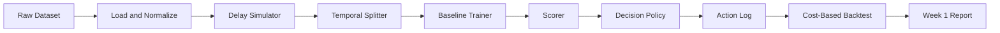

# Problem Framing: Delayed-Label Fraud Decisioning

> **Repository:** `delayed-label-fraud-decisioning`  
> **Course:** Introduction to Machine Learning  
> **Document:** Problem framing / project charter  
> **Status:** v0.2 — aligned with Week 1 MVP  
> **Last updated:** YYYY-MM-DD

---

## 1. One-Sentence Project

Build and evaluate a cost-sensitive fraud decision policy that makes `approve`, `review`, or `block` decisions at transaction time using only features available then, while fraud labels are delayed and only partially observed by evaluation time.

---

## 2. Core Question

> How can a fraud decision policy be trained and evaluated when fraud labels arrive late, are censored at evaluation time, and have asymmetric operational costs?

This is not a standard binary classification project. It is a **one-step decision problem under delayed, partial, and biased feedback**. The model predicts fraud probability; the policy maps that probability to an operational action.

---

## 3. First-Principles Problem Statement

At decision time `t`, the system observes transaction features `X_t` and must choose an action:

- `approve`
- `review`
- `block`

The true label `y_t` is not available at time `t`. It becomes observable later at:

```text
label_time = t + Δ_t
```

where `Δ_t` is the label delay.

The system must optimize expected operational utility:

```text
maximize  E[ utility(action_t, y_t, cost_t) ]
```

where utility depends on:

- fraud loss avoided
- false-positive friction cost
- review / investigation cost
- operational capacity
- customer experience

The model is only one component. The decision policy is the product being evaluated.

```text
observe → decide → act → observe delayed/partial outcome → evaluate
```

Full online adaptation and delayed-label correction are future work, not Week 1 requirements.

---

## 4. Why This Problem Exists

Modern payment systems separate authorization, clearing, dispute, and chargeback.

This creates a structural gap:

1. A transaction must be approved or declined in **milliseconds to seconds**.
2. Fraud truth may arrive **30–120 days later** as a chargeback, dispute, or investigation outcome.
3. On real-time rails such as RTP, FedNow, UPI, and Pix, funds may become **irrevocable** before fraud is confirmed.
4. Fraudsters adapt faster than retraining cycles.
5. Investigators have limited capacity.
6. False positives create customer friction and revenue loss.

Therefore, the core difficulty is not “which model gets the best AUC?”  
The core difficulty is:

> How do we make and evaluate cost-based decisions when the feedback loop is delayed, partial, biased, and adversarial?

---

## 5. First-Principles Decomposition

| Layer | Question | Implication |
|---|---|---|
| Operational problem | Decide in real time with incomplete future information | Cannot wait for labels |
| Why it exists | Payment lifecycle separates decision from dispute outcome | Labels arrive late |
| Constraints | Latency, cost asymmetry, capacity, privacy, regulation | Cannot simply maximize recall |
| Root causes | Delayed chargebacks, censored labels, unreported fraud, investigation bias | Observed labels are not ground truth |
| Conventional failure | Offline random-split AUC on resolved labels | Overestimates live performance |
| Why still hard | Nonstationarity + delayed feedback + adversarial adaptation | Model learns from a biased, delayed view |
| ML contribution | Calibrated probability model + cost-sensitive decision policy | Model must match the decision loop |
| Measurable objective | Fraud loss avoided at fixed false-positive or review budget | Business-relevant evaluation |
| Data required | Timestamped transactions, actions, features, delayed labels | Temporal data is mandatory |
| MVP | Baseline model + cost-sensitive policy + temporal backtest | Buildable in one semester |

---

## 6. System Scope

### In Scope

- Chronological transaction replay from a static dataset
- Time-aware feature computation
- Delayed-label simulation with documented rules
- Chronological train / validation / test splits
- Fraud scoring model
- Cost-sensitive decision policy
- Action logging
- Cost-based temporal backtest
- Calibration measurement
- Sensitivity analysis on cost assumptions
- Reproducible evaluation

### Out of Scope for Week 1 and Core Final Project

- Streaming infrastructure such as Kafka, RabbitMQ, or Faust
- FastAPI or any service layer
- Dashboards such as Streamlit, Grafana, or Dash
- Online learning such as SGD or Passive-Aggressive
- PU learning
- Delayed-label correction models
- Drift detectors
- Graph neural networks or graph features
- Federated learning
- Production bank integration
- Real PII or live customer data
- Novel algorithm research
- Deep learning unless a measured baseline failure justifies it

These are future work, not Week 1 requirements.

---

## 7. System Architecture

Week 1 is a batch pipeline, not a production system.



### Components

1. **Raw Dataset** — BAF primary; IEEE-CIS optional later.
2. **Load and Normalize** — standard schema, timestamps, sorting.
3. **Delay Simulator** — assign `decision_time` and `label_time` under fixed delay regimes.
4. **Temporal Splitter** — chronological train / validation / test.
5. **Baseline Trainer** — LightGBM binary classifier.
6. **Scorer** — attach `p_fraud` to each test transaction.
7. **Decision Policy** — map `p_fraud` and costs to `approve`, `review`, or `block`.
8. **Action Log** — audit trail of decisions and expected costs.
9. **Cost-Based Backtest** — realized cost, fraud dollars saved, precision@N, calibration.
10. **Week 1 Report** — baseline comparison, failure cases, limitations.

---

## 8. Data Strategy

### Primary Dataset

**Bank Account Fraud (BAF) Suite**

Why:

- Public and open
- Tabular fraud detection
- Realistic feature set
- Suitable for temporal experiments
- Manageable size for a student project

### Secondary Dataset

**IEEE-CIS Fraud Detection** — optional.

Use only if BAF is insufficient. Keep it out of Week 1 unless needed.

### Label Delay Simulation

Public fraud datasets do not usually provide realistic chargeback timestamps. Delay must be simulated.

Week 1 rule:

```text
decision_time = t
label_time    = t + Δ
```

Use fixed delay per regime:

| Regime | Δ |
|---|---|
| Short | 7 days |
| Medium | 30 days |
| Long | 90 days |

If BAF does not support day-level timestamps, fall back to month-based regimes (1 / 2 / 3 months) and document the fallback in `data_card.md`.

Censoring rule:

```text
A label is observed only if label_time <= evaluation_end.
Unobserved labels are censored, not negative.
```

### Time-Aware Splits

Training at time `T` may only use labels where:

```text
label_time <= T
```

Testing must use future transactions:

```text
decision_time > T
```

No random splits. No shuffling. No cross-validation across time boundaries.

---

## 9. ML Formulation

### Input

Features available at decision time:

```text
X_t
```

### Target

Delayed fraud label:

```text
y_t ∈ {0, 1}
```

available only at:

```text
t + Δ_t
```

### Baseline

- LightGBM binary classifier
- Trained on matured labels only
- Static threshold baseline for comparison

### Decision Policy

Given predicted probability `p = P(y=1 | X_t)`, choose the action minimizing expected cost:

```text
E[cost(approve)] = p * fraud_loss
E[cost(review)]  = review_cost + p * residual_fraud_loss
E[cost(block)]   = (1 - p) * false_positive_cost
```

Choose the action with the lowest expected cost.

Week 1 default: constant `fraud_loss` for simplicity.  
Required sensitivity analysis: amount-scaled fraud loss.

### Future Improvements

- Calibration
- Cost-sensitive training
- Amount-scaled costs
- Capacity-aware policy
- Online learning
- PU learning
- Delayed-label correction
- Drift-aware retraining

These are not Week 1 requirements.

---

## 10. Evaluation Framework

### Primary Metrics

- Cost per transaction
- Total cost
- Fraud dollars saved at fixed false-positive rate
- Fraud dollars saved at fixed review budget
- Precision@N alerts
- Recall@N alerts
- Calibration error: Brier score and ECE

### Temporal Metrics

- Performance over time
- Offline-vs-live gap
- Per-window variance in later weeks

### Canonical Week 1 Baselines

1. Random decision
2. Approve-all
3. Block-all
4. Rule-based threshold
5. Offline LightGBM + static threshold
6. Cost-sensitive policy using the same LightGBM probabilities

### Validation Protocol

- Chronological backtest only
- Fixed delay regimes: 7 / 30 / 90 days
- Fixed cost matrix in `configs/costs.yaml`
- Fixed review budget: top 1% / 5% / 10%
- Report results separately per delay regime
- Report censored-label counts
- Do not tune thresholds on the test set

---

## 11. MVP Definition: 3–4 Weeks

### Week 1 — Baseline End-to-End Loop

- Load BAF
- Simulate 7 / 30 / 90 day label delay
- Build chronological splits
- Train LightGBM baseline
- Score test set
- Apply cost-sensitive policy
- Write action log
- Run cost-based backtest
- Write `reports/week1_backtest.md`

### Week 2 — Calibration and Cost-Sensitive Model

- Measure Brier score and ECE
- Apply Platt scaling or isotonic regression if needed
- Compare cost-sensitive LightGBM against baseline
- Keep same splits, delay regimes, and cost matrix

### Week 3 — Policy and Sensitivity

- Add amount-scaled cost sensitivity
- Add budget-constrained metrics
- Optionally add capacity simulation as a separate experiment
- Report how policy choices change under different costs

### Week 4 — One Optional Improvement and Final Report

- Add one improvement only if justified by a measured Week 1 failure
- Candidate improvements: calibration, cost-sensitive training, capacity-aware policy
- Do not add online learning, PU learning, or delayed-label correction unless the baseline clearly fails
- Write final report
- Record demo
- Ensure reproducibility

### MVP Deliverables

- Reproducible repository
- `README.md`
- `docs/problem_framing.md`
- Data pipeline
- Delay simulator
- Temporal splitter
- Baseline model
- Decision policy
- Cost-based backtest
- Evaluation report
- Notebook or Markdown demo

---

## 12. Success Criteria

The project succeeds if:

- The cost-sensitive policy produces lower realized cost than approve-all, block-all, random, rule-based, and static-threshold baselines under the same chronological splits, delay regime, cost matrix, and review budget.
- Calibration is measured and reported.
- Censored-label counts are reported per split and delay regime.
- Results are reproducible from raw data, configs, and seeds.
- Sensitivity analysis does not reverse the main conclusion.
- The final report clearly explains the pain point, root cause, ML formulation, evaluation, and limitations.

These are measurable. Presentation quality is important, but it is not a substitute for these criteria.

---

## 13. Risks and Mitigations

| Risk | Mitigation |
|---|---|
| Public data lacks realistic label delays | Simulate fixed delay regimes; document assumptions |
| BAF timestamp granularity is insufficient | Verify before modeling; fallback to month-based regimes |
| Temporal leakage | Strict time-aware splits; feature audit |
| Censored labels bias evaluation | Report censored counts; never treat censored as negative |
| Unrealistic cost matrix | Run sensitivity analysis |
| Scope creep | Stick to Week 1 MVP and non-goals |
| Dashboard takes too long | Use notebook plots and Markdown report instead |
| Overclaiming delayed-label learning | State that Week 1 uses matured labels only |

---

## 14. Non-Goals

- Do not invent a new algorithm.
- Do not use deep learning just because it is popular.
- Do not build a production bank system.
- Do not claim causal proof.
- Do not optimize only AUC.
- Do not ignore operational costs.
- Do not build streaming, dashboards, online learning, PU learning, or delayed-label correction in Week 1.

---

## 15. Future Work

- Delayed-label correction models
- PU learning with censored negatives
- Bandit-based threshold optimization
- Drift detection and automated retraining
- Entity graph features
- Federated learning across simulated institutions
- Investigator feedback loops
- Capacity-aware scheduling
- Fairness-aware policy constraints

---

## 16. References and Data Sources

- Bank Account Fraud (BAF) Suite — Jesus et al., NeurIPS 2022
- IEEE-CIS Fraud Detection — Kaggle
- Cost-sensitive learning — Elkan 2001
- PU learning — Elkan & Noto 2008
- Chargeback and dispute lifecycle documentation
- Online learning literature

---

## 17. Definition of Done

- [ ] Problem framing documented
- [ ] Dataset selected
- [ ] BAF timestamp granularity verified
- [ ] Label delay simulator implemented
- [ ] Temporal split implemented
- [ ] Baseline model trained
- [ ] Cost-sensitive policy implemented
- [ ] Evaluation harness implemented
- [ ] Cost-based backtest written
- [ ] Calibration measured
- [ ] Censored-label counts reported
- [ ] Sensitivity analysis run
- [ ] README completed
- [ ] Repository pushed to GitHub
