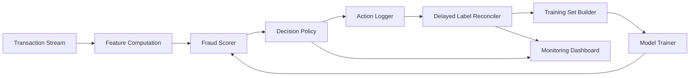

# Problem Framing: Delayed-Label Fraud Decisioning

> **Repository:** `delayed-label-fraud-decisioning`  
> **Course:** Introduction to Machine Learning  
> **Document:** Problem framing / project charter  
> **Status:** v0.1  
> **Last updated:** YYYY-MM-DD

---

## 1. One-Sentence Project

Build an end-to-end machine learning system that makes **real-time fraud decisions** under **delayed, partial, and biased labels**, optimizing **operational utility** rather than offline classification accuracy alone.

---

## 2. Core Question

> How can a fraud detection system decide **now** when the truth about whether that decision was correct may not arrive for **weeks or months**?

This is not a standard classification problem. It is a **sequential decision-making problem under delayed feedback, asymmetric costs, and nonstationarity**.

---

## 3. First-Principles Problem Statement

At decision time `t`, the system observes transaction features `X_t` and must choose an action:

- `approve`
- `review`
- `block`

The true label `y_t` is not available at time `t`. It arrives later at time `t + Δ_t`, where `Δ_t` is the label delay.

The system must therefore optimize expected utility over a horizon:

```text
maximize  E[ Σ utility(action_t, y_t, cost_t) ]
```

where utility depends on:

- fraud loss avoided
- false-positive friction cost
- review/investigation cost
- operational capacity
- customer experience
- regulatory constraints

The model is only one component. The real system is:

```text
observe → decide → act → observe delayed/biased outcome → update → monitor → adapt
```

---

## 4. Why This Problem Exists

Modern payment systems separate authorization, clearing, dispute, and chargeback.

This creates a structural gap:

1. A transaction must be approved or declined in **milliseconds to seconds**.
2. Fraud truth may arrive **30–120 days later** as a chargeback, dispute, or investigation outcome.
3. On real-time rails such as RTP, FedNow, UPI, and Pix, funds may become **irrevocable** before fraud is confirmed.
4. Fraudsters adapt faster than retraining cycles.
5. Investigators have limited capacity.
6. False positives create customer friction and revenue loss.

Therefore, the core difficulty is not “which model gets the best AUC?”  
The core difficulty is:

> How do we learn and decide when the feedback loop is delayed, partial, biased, and adversarial?

---

## 5. First-Principles Decomposition

| Layer | Question | Implication |
|---|---|---|
| Operational problem | Decide in real time with incomplete future information | Cannot wait for labels |
| Why it exists | Payment lifecycle separates decision from dispute outcome | Labels arrive late |
| Constraints | Latency, cost asymmetry, capacity, privacy, regulation | Cannot simply maximize recall |
| Root causes | Delayed chargebacks, censored labels, unreported fraud, investigation bias | Observed labels are not ground truth |
| Conventional failure | Offline random-split AUC on resolved labels | Overestimates live performance |
| Why still hard | Nonstationarity + delayed feedback + adversarial adaptation | Model learns from a biased, delayed view |
| ML contribution | Online learning, PU learning, delayed-label correction, cost-sensitive policy | Model must match the decision loop |
| Measurable objective | Fraud loss avoided at fixed false-positive or review budget | Business-relevant evaluation |
| Data required | Timestamped transactions, actions, features, delayed labels | Temporal data is mandatory |
| MVP | Streaming simulator + baseline + cost-sensitive policy + temporal backtest | Buildable in one semester |

---

## 6. System Scope

### In Scope

- Streaming transaction simulation
- Time-aware feature computation
- Fraud scoring model
- Cost-sensitive decision policy
- Action logging
- Delayed label reconciliation
- Temporal backtesting
- Monitoring dashboard
- Reproducible evaluation

### Out of Scope

- Production bank integration
- Real PII or live customer data
- Novel algorithm research
- Deep learning unless justified by the problem
- Graph neural networks unless the baseline clearly fails
- Full federated learning deployment
- Legal or regulatory compliance certification

---

## 7. System Architecture



### Components

1. **Transaction Stream** — chronological events with timestamps.
2. **Feature Computation** — only features available at decision time.
3. **Fraud Scorer** — baseline: LightGBM/XGBoost; improvement: online SGD/PA, PU learning.
4. **Decision Policy** — maps score + costs to `approve`, `review`, or `block`.
5. **Action Logger** — records decisions, scores, thresholds, and reasons.
6. **Delayed Label Reconciler** — joins labels only when they become available.
7. **Training Set Builder** — builds time-correct training data.
8. **Model Trainer** — retrains or updates online.
9. **Monitoring Dashboard** — tracks cost, drift, calibration, and alert volume.

---

## 8. Data Strategy

### Primary Dataset

**Bank Account Fraud (BAF) Suite**

Why:

- Public and open
- Tabular fraud detection
- Realistic feature set
- Suitable for temporal experiments
- Manageable size for a student project

### Secondary Dataset

**IEEE-CIS Fraud Detection**

Why:

- Large transaction dataset
- Rich features
- Useful for graph and feature engineering extensions

### Label Delay Simulation

Since public datasets do not usually provide realistic chargeback timestamps, simulate them.

For each transaction:

```text
decision_time = t
label_time = t + Δ
```

Where `Δ` can be:

- 7 days
- 30 days
- 90 days

For fraud cases, sample delay from a realistic distribution.  
For non-fraud cases, assign a fixed observation window or administrative label time.

### Time-Aware Splits

Training at time `T` may only use labels where:

```text
label_time <= T
```

Testing must use future transactions:

```text
decision_time > T
```

This prevents temporal leakage.

---

## 9. ML Formulation

### Input

Features available at decision time:

```text
X_t
```

### Target

Delayed fraud label:

```text
y_t ∈ {0, 1}
```

available only at:

```text
t + Δ_t
```

### Baseline

- LightGBM or XGBoost
- Static threshold
- Offline training on resolved labels

### Improvements

- Online SGD / Passive-Aggressive
- PU learning
- Delayed-label correction
- Cost-sensitive thresholding
- Calibration
- Drift-aware retraining

### Decision Policy

Given predicted probability `p = P(y=1 | X_t)`, choose action minimizing expected cost:

```text
Expected cost(approve) = p * fraud_loss
Expected cost(review)  = review_cost + p * residual_fraud_loss
Expected cost(block)   = (1 - p) * false_positive_cost
```

Choose the action with the lowest expected cost.

---

## 10. Evaluation Framework

### Primary Metrics

- Cost per transaction
- Fraud dollars saved at fixed false-positive rate
- Fraud dollars saved at fixed review budget
- Precision@N alerts
- Recall@N alerts
- Calibration error

### Temporal Metrics

- Performance over time
- Time-to-detect drift
- Recovery after retraining
- Offline-vs-live gap

### Baselines

1. Random decision
2. Rule-based threshold
3. Offline LightGBM with static threshold
4. Cost-sensitive LightGBM
5. Online SGD / Passive-Aggressive

### Validation Protocol

- Chronological backtest
- Multiple label-delay regimes: 7 / 30 / 90 days
- Fixed cost matrix
- Fixed alert budget
- Report both fraud and friction costs

---

## 11. MVP Definition: 3–4 Weeks

### Week 1 — Data and Delay Simulation

- Load BAF or IEEE-CIS
- Build chronological splits
- Simulate 7/30/90-day label delay
- Create evaluation harness

### Week 2 — Baseline System

- Train LightGBM/XGBoost
- Apply static threshold
- Measure cost, PR-AUC, precision@N, calibration

### Week 3 — Decision Policy and Improvement

- Add cost-sensitive policy
- Add online SGD / PA
- Add PU learning or delayed-label correction
- Compare against baseline

### Week 4 — System and Demo

- Add action logger
- Add delayed label reconciler
- Add monitoring dashboard
- Write README and results
- Record demo

### MVP Deliverables

- Reproducible repository
- `README.md`
- `docs/problem_framing.md`
- Data pipeline
- Delay simulator
- Baseline model
- Improved model
- Evaluation report
- Dashboard or notebook demo

---

## 12. Success Criteria

- The project is problem-driven, not model-driven.
- The system makes decisions under simulated delayed labels.
- Evaluation uses cost-sensitive and temporal metrics.
- Baseline and improvement are compared fairly.
- Results are reproducible.
- The repository is portfolio-ready.
- The final presentation clearly explains:
  - the pain point
  - the root cause
  - the ML formulation
  - the evaluation
  - the limitations

---

## 13. Risks and Mitigations

| Risk | Mitigation |
|---|---|
| Public data lacks realistic label delays | Simulate multiple delay regimes |
| Temporal leakage | Strict time-aware splits |
| Online learning unstable | Compare against LightGBM baseline |
| Scope creep | Stick to MVP and non-goals |
| Unrealistic cost matrix | Run sensitivity analysis |
| Dashboard takes too long | Start with notebook plots, then add dashboard |

---

## 14. Non-Goals

- Do not invent a new algorithm.
- Do not use deep learning just because it is popular.
- Do not build a production bank system.
- Do not claim causal proof.
- Do not optimize only AUC.
- Do not ignore operational costs.

---

## 15. Future Work

- Delayed-label correction models
- PU learning with censored negatives
- Bandit-based threshold optimization
- Drift detection and automated retraining
- Entity graph features
- Federated learning across simulated institutions
- Investigator feedback loops

---

## 16. References and Data Sources

- Bank Account Fraud (BAF) Suite
- IEEE-CIS Fraud Detection Dataset
- Chargeback and dispute lifecycle documentation
- Cost-sensitive learning literature
- PU learning literature
- Online learning literature

---

## 17. Definition of Done

- [ ] Problem framing documented
- [ ] Dataset selected
- [ ] Label delay simulator implemented
- [ ] Temporal split implemented
- [ ] Baseline model trained
- [ ] Cost-sensitive policy implemented
- [ ] Evaluation harness implemented
- [ ] Improved model compared
- [ ] Dashboard or demo created
- [ ] README completed
- [ ] Repository pushed to GitHub
