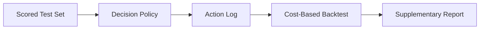

# Problem Framing: Delayed-Label Fraud Decisioning

> **Repository:** `delayed-label-fraud-decisioning`  
> **Course:** Introduction to Machine Learning — Final Group Project  
> **Institution:** National University Philippines  
> **Instructor:** Ken Oliver Caparros  
> **Document:** Problem framing / project charter  
> **Status:** v0.3 — aligned with course requirements and three-algorithm comparison  
> **Last updated:** 2026-09-22

---

## 1. One-Sentence Project

Build and compare three traditional machine learning algorithms for fraud
classification on the Bank Account Fraud (BAF) dataset, deploy the best
model through a Streamlit application, and — as a supplementary layer —
evaluate a cost-sensitive decision policy under a delayed-label regime that
reflects the operational reality of fraud detection.

---

## 2. Core Question

> Which of three traditional machine learning algorithms — Logistic
> Regression, Random Forest, and LightGBM — performs best at predicting
> fraud on the Bank Account Fraud dataset under a fair, reproducible
> experimental design, and how does the best model translate into an
> operational `approve` / `review` / `block` decision under delayed and
> censored labels?

The primary question is a **supervised binary classification** comparison.
The supplementary question is a **one-step decision problem** that maps the
classification output to an operational action.

---

## 3. First-Principles Problem Statement

At decision time `t`, the system observes transaction features `X_t` and must
predict whether the transaction is fraudulent:

```text
ŷ_t = f(X_t)   where   y_t ∈ {0, 1}
```

The primary formulation is standard binary classification. The supplementary
formulation extends the prediction into an action:

- `approve`
- `review`
- `block`

The true label `y_t` is not available at time `t`. It becomes observable later
at:

```text
label_time = t + Δ_t
```

where `Δ_t` is the label delay.

Under the supplementary decision framing, the system optimizes expected
operational utility:

```text
maximize  E[ utility(action_t, y_t, cost_t) ]
```

where utility depends on:

- fraud loss avoided
- false-positive friction cost
- review / investigation cost
- operational capacity
- customer experience

The model is the primary deliverable. The decision policy is a supplementary
layer that demonstrates how the classification output maps to a real
operational decision.

```text
observe → predict → (decide) → act → observe delayed/partial outcome → evaluate
```

Full online adaptation and delayed-label correction are future work.

---

## 4. Why This Problem Exists

Modern payment systems separate authorization, clearing, dispute, and
chargeback.

This creates a structural gap:

1. A transaction must be approved or declined in **milliseconds to seconds**.
2. Fraud truth may arrive **30–120 days later** as a chargeback, dispute, or
   investigation outcome.
3. On real-time rails such as RTP, FedNow, UPI, and Pix, funds may become
   **irrevocable** before fraud is confirmed.
4. Fraudsters adapt faster than retraining cycles.
5. Investigators have limited capacity.
6. False positives create customer friction and revenue loss.

Therefore, the core difficulty is not only “which model gets the best AUC?”
The broader difficulty is:

> How do we build, compare, and deploy fraud classification models that
> translate into cost-based decisions when the feedback loop is delayed,
> partial, biased, and adversarial?

---

## 5. First-Principles Decomposition

| Layer | Question | Implication |
|---|---|---|
| Operational problem | Decide in real time with incomplete future information | Cannot wait for labels |
| Why it exists | Payment lifecycle separates decision from dispute outcome | Labels arrive late |
| Constraints | Latency, cost asymmetry, capacity, privacy, regulation | Cannot simply maximize recall |
| Root causes | Delayed chargebacks, censored labels, unreported fraud, investigation bias | Observed labels are not ground truth |
| Conventional failure | Offline random-split AUC on resolved labels | Overestimates live performance |
| Why still hard | Nonstationarity + delayed feedback + adversarial adaptation | Model learns from a biased, delayed view |
| **Primary ML contribution** | **Fair comparison of three traditional classifiers** | **Course requirement** |
| Supplementary ML contribution | Calibrated probability model + cost-sensitive decision policy | Model must match the decision loop |
| Measurable objective | Macro F1 and operational cost per transaction | Business-relevant evaluation |
| Data required | Timestamped transactions, features, labels | Temporal data enables fair evaluation |
| Deliverable | Three-algorithm comparison + Streamlit app + IMRaD paper | Course requirement |

---

## 6. System Scope

### In Scope — Primary (Course Requirement)

- Exploratory data analysis with at least five meaningful visualizations
- Data preparation: missing values, duplicates, outliers, encoding, scaling,
  feature selection, class imbalance handling
- **Exactly three traditional algorithms:**
  - Logistic Regression
  - Random Forest
  - LightGBM
- Fair experimental design:
  - Same data split across all three algorithms
  - Same preprocessing logic
  - Same 5-fold cross-validation strategy
  - Same primary metric (Macro F1)
  - Documented hyperparameters and tuning procedure
- Model selection based on validation results
- Final evaluation once on an untouched test set
- **Deployable Streamlit application** using the saved best model and the
  same preprocessing pipeline
- IMRaD-style paper in IEEE format
- Technical documentation, data dictionary, contribution record, and signed
  ownership declaration

### In Scope — Supplementary (Project Depth)

- Chronological transaction replay from a static dataset
- Delayed-label simulation with documented rules
- Chronological train / validation / test splits
- Cost-sensitive decision policy over `approve` / `review` / `block`
- Action logging
- Cost-based temporal backtest
- Calibration measurement
- Sensitivity analysis on cost assumptions
- Reproducible evaluation

### Out of Scope

- Neural networks, deep learning, CNNs, RNNs, transformers, LLMs
- Pretrained foundation models
- AutoML-generated solutions
- Streaming infrastructure such as Kafka, RabbitMQ, or Faust
- FastAPI or any service layer
- Online learning such as SGD or Passive-Aggressive
- PU learning
- Delayed-label correction models
- Drift detectors
- Graph neural networks or graph features
- Federated learning
- Production bank integration
- Real PII or live customer data
- Novel algorithm research

These are future work and are not part of the course submission.

---

## 7. System Architecture

The project has two layers. The primary layer is the classification pipeline;
the supplementary layer adds the decision policy.

### Primary Pipeline (Course Requirement)


### Supplementary Pipeline (Project Depth)



### Components

1. **Raw Dataset** — BAF `Base.csv`, 1,000,000 rows, 32 features.
2. **Load and Clean** — standard schema, deduplication, type normalization.
3. **EDA** — distributions, relationships, class balance, outliers, at least
   five visualizations with written findings.
4. **Preprocessing** — missing values, encoding, scaling, feature selection,
   class imbalance handling; fit on training data only.
5. **Three-Algorithm Training** — Logistic Regression, Random Forest,
   LightGBM; identical folds and preprocessing.
6. **Cross-Validation Comparison** — 5-fold time-series CV; mean and
   variability reported.
7. **Model Selection** — based on primary metric, interpretability, speed,
   practical suitability.
8. **Final Test Evaluation** — once on the untouched test set.
9. **Streamlit App** — loads saved model and preprocessing pipeline;
   validated inputs; clear output.
10. **Decision Policy (Supplementary)** — maps `p_fraud` and costs to
    `approve`, `review`, or `block`.
11. **Action Log (Supplementary)** — audit trail of decisions.
12. **Cost-Based Backtest (Supplementary)** — realized cost, fraud dollars
    saved, precision@N.

---

## 8. Data Strategy

### Primary Dataset

**Bank Account Fraud (BAF) Suite**

| Field | Value |
|---|---|
| Source | Jesus et al., NeurIPS 2022 |
| License | CC BY 4.0 |
| Rows | 1,000,000 |
| Features | 32 raw (31 excluding label) |
| Target | `fraud_bool` (binary) |
| Time column | `month`, values 0–7 |
| Fraud rate | ~1.1% |

Why chosen:

- Public and citable
- Tabular fraud detection with mixed feature types
- Suitable for temporal and delay experiments
- Manageable size for a student project
- Legitimate license for academic use

### Secondary Dataset

**IEEE-CIS Fraud Detection** — optional. Not used in the current submission.

### Class Imbalance

Fraud is ~1.1% of transactions. This is addressed in:

- Primary metric choice (Macro F1, not accuracy)
- Preprocessing (class weights or documented resampling strategy)
- Per-class precision, recall, and F1 reporting
- Confusion matrix analysis

### Label Delay Simulation (Supplementary)

Public fraud datasets do not provide realistic chargeback timestamps. Delay
is simulated to support the supplementary analysis.

```text
decision_time = t
label_time    = t + Δ
```

BAF exposes month-level granularity only, so the delay regime is **1 month**
in the current build. Day-based regimes (7 / 30 / 90 days) are documented as
future work.

Censoring rule:

```text
A label is observed only if label_time <= evaluation_end.
Unobserved labels are censored, not negative.
```

### Time-Aware Splits

For the supplementary analysis, training at time `T` may only use labels
where:

```text
label_time <= T
```

Testing uses future transactions:

```text
decision_time > T
```

For the primary classification comparison, a chronological 80/20 train/test
split is used, with 5-fold time-series cross-validation on the training data.
No random splits. No shuffling.

---

## 9. ML Formulation

### Primary — Three-Algorithm Classification

**Input:** Features available at decision time.

```text
X_t
```

**Target:** Binary fraud label.

```text
y_t ∈ {0, 1}
```

**Algorithms compared:**

| Algorithm | Role | Why included |
|---|---|---|
| Logistic Regression | Linear baseline | Interpretable coefficients; fast; widely used in fraud |
| Random Forest | Non-linear ensemble | Handles mixed types and interactions; robust to outliers |
| LightGBM | Gradient boosting | Strong tabular performance; handles categorical features natively |

**Fairness conditions:**

- Same training/test split
- Same preprocessing pipeline (fit on training data only)
- Same 5-fold cross-validation strategy
- Same primary metric: Macro F1
- Documented hyperparameter tuning procedure
- Test set used once, after model selection

**Primary metric:** Macro F1

Justification: the class distribution is heavily imbalanced (~1.1% fraud).
Accuracy is misleading. Macro F1 treats both classes equally and reflects the
operational cost of both false positives and false negatives.

**Supporting metrics:**

- Accuracy
- Per-class precision, recall, F1
- Confusion matrix
- ROC-AUC (informational)
- Precision@N and Recall@N

### Supplementary — Decision Policy

Given predicted probability `p = P(y=1 | X_t)`, choose the action minimizing
expected cost:

```text
E[cost(approve)] = p * fraud_loss(amount)
E[cost(review)]  = review_cost + p * residual_fraud_loss
E[cost(block)]   = (1 - p) * false_positive_cost
```

Choose the action with the lowest expected cost.

The argmin rule is the source of truth. Derived thresholds are a diagnostic
view only.

### Future Improvements

- Calibration (Platt, isotonic)
- Cost-sensitive training
- Amount-scaled costs (already adopted in supplementary analysis)
- Capacity-aware policy
- Online learning
- PU learning
- Delayed-label correction
- Drift-aware retraining
- Additional delay regimes (2-month, 3-month)

These are not part of the current submission.

---

## 10. Evaluation Framework

### Primary Metrics — Classification

| Metric | Purpose |
|---|---|
| **Macro F1** | Primary metric; imbalance-aware |
| Accuracy | Reported for completeness; not the selection criterion |
| Per-class precision | Fraud and non-fraud |
| Per-class recall | Fraud and non-fraud |
| Per-class F1 | Fraud and non-fraud |
| Confusion matrix | Full error breakdown |
| ROC-AUC | Informational; threshold-independent |

### Supplementary Metrics — Decision Policy

- Cost per transaction
- Total cost
- Fraud dollars saved
- Precision@N alerts
- Recall@N alerts
- Calibration: Brier score, ECE

### Validation Protocol

- **Primary:** 5-fold time-series cross-validation on the training data
- **Final:** one evaluation on the untouched test set
- **Supplementary:** chronological backtest under a 1-month delay regime
- **No tuning on the test set**

### Baselines

For the **primary** comparison, the three algorithms serve as each other's
baselines. A trivial baseline (majority class) is reported for context.

For the **supplementary** decision analysis:

1. Random decision
2. Approve-all
3. Block-all
4. LightGBM + static 0.5
5. Cost-sensitive policy

---

## 11. Project Timeline

### Week 1 — EDA and Data Preparation

- Load BAF
- Exploratory data analysis with at least five visualizations
- Data dictionary
- Preprocessing pipeline
- Chronological 80/20 split
- 5-fold time-series CV folds defined

### Week 2 — Three-Algorithm Training

- Logistic Regression with tuning
- Random Forest with tuning
- LightGBM with tuning
- Cross-validation comparison
- Validation results table

### Week 3 — Final Evaluation and App

- Select best model on validation
- Evaluate once on untouched test set
- Build Streamlit application
- Test with valid, invalid, and boundary inputs
- Deploy to Streamlit Cloud

### Week 4 — Paper and Documentation

- IMRaD paper (DOCX + PDF)
- Technical documentation
- Contribution record
- Ownership and authorship declaration
- Final submission package

### Supplementary (Parallel)

- Cost-sensitive decision policy
- Cost-based backtest
- Sensitivity analysis
- Bootstrap confidence intervals

---

## 12. Success Criteria

### Primary (Course Requirement)

The project succeeds if:

- Three traditional algorithms are compared under identical conditions
- The primary metric (Macro F1) is justified and reported for all three
- Validation results include mean and variability across folds
- The final test set is used exactly once, after model selection
- The selected model is justified on performance, interpretability, speed,
  and practical suitability
- The Streamlit app uses the same saved model and preprocessing pipeline
  reported in the paper
- EDA includes at least five meaningful visualizations, each leading to a
  finding or decision
- The IMRaD paper is complete with IEEE numbered citations
- All required deliverables are submitted

### Supplementary (Project Depth)

- The cost-sensitive policy produces lower realized cost than all baselines
  under the same chronological split and cost matrix
- Calibration is measured and reported
- Censored-label counts are reported
- Results are reproducible from raw data, configs, and seeds
- Sensitivity analysis does not reverse the main conclusion

---

## 13. Risks and Mitigations

| Risk | Mitigation |
|---|---|
| Class imbalance biases model selection | Use Macro F1 as primary; report per-class metrics |
| Data leakage through preprocessing | Fit all preprocessing on training data only |
| Test set contamination | Use test set once, after model selection |
| Algorithm comparison unfair | Same split, same preprocessing, same CV, same metric |
| Temporal leakage in supplementary analysis | Strict time-aware splits; feature audit |
| Censored labels bias supplementary evaluation | Report censored counts; never treat as negative |
| Unrealistic cost matrix | Run sensitivity analysis |
| Scope creep | Stick to three algorithms and course deliverables |
| Streamlit app crashes on invalid input | Validate inputs; test boundary cases |
| Overclaiming delayed-label learning | State that matured labels only are used |

---

## 14. Non-Goals

### Primary (Course)

- Do not use neural networks, deep learning, transformers, or LLMs
- Do not use AutoML-generated solutions
- Do not count hyperparameter variants as different algorithms
- Do not use the test set for model selection or tuning
- Do not rely on accuracy alone for an imbalanced problem

### Supplementary (Project)

- Do not invent a new algorithm
- Do not build a production bank system
- Do not claim causal proof
- Do not optimize only AUC
- Do not ignore operational costs
- Do not build streaming, online learning, PU learning, or delayed-label
  correction

---

## 15. Future Work

- Additional delay regimes (2-month, 3-month)
- Delayed-label correction models
- PU learning with censored negatives
- Bandit-based threshold optimization
- Drift detection and automated retraining
- Entity graph features
- Federated learning across simulated institutions
- Investigator feedback loops
- Capacity-aware scheduling
- Fairness-aware policy constraints
- Cost-sensitive training

---

## 16. References and Data Sources

- Bank Account Fraud (BAF) Suite — Jesus et al., NeurIPS 2022
- IEEE-CIS Fraud Detection — Kaggle
- Cost-sensitive learning — Elkan 2001
- PU learning — Elkan & Noto 2008
- Scikit-learn documentation — Pedregosa et al., 2011
- LightGBM documentation — Ke et al., 2017
- Chargeback and dispute lifecycle documentation
- Online learning literature

---

## 17. Definition of Done

### Primary (Course Requirement)

- [ ] Problem framing documented
- [ ] Dataset selected and documented
- [ ] EDA notebook complete with at least five visualizations
- [ ] Data dictionary complete
- [ ] Preprocessing pipeline implemented
- [ ] Chronological 80/20 split defined
- [ ] 5-fold time-series CV defined
- [ ] Logistic Regression trained and tuned
- [ ] Random Forest trained and tuned
- [ ] LightGBM trained and tuned
- [ ] Validation results compared
- [ ] Best model selected and justified
- [ ] Final test evaluation complete
- [ ] Streamlit app built and deployed
- [ ] App tested with valid, invalid, and boundary inputs
- [ ] IMRaD paper written (DOCX + PDF)
- [ ] Technical documentation complete
- [ ] Contribution record signed
- [ ] Ownership declaration signed
- [ ] Repository pushed to GitHub with ZIP archive

### Supplementary (Project Depth)

- [x] Label delay simulator implemented
- [x] Temporal split implemented
- [x] Cost-sensitive policy implemented
- [x] Cost-based backtest written
- [x] Calibration measured
- [x] Censored-label counts reported
- [x] Sensitivity analysis run
- [x] Bootstrap confidence intervals computed
